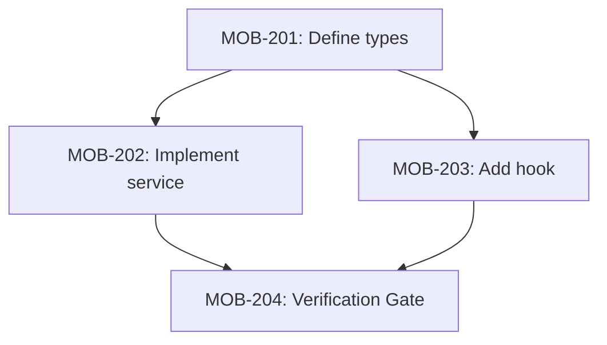

<objective>
Transform an issue into a set of focused, executable sub-tasks through deep codebase exploration. Each sub-task targets a single file or tightly-coupled file pair, sized to fit within one Claude context window. Sub-tasks are created with blocking relationships to enable parallel work where dependencies allow.
</objective>

<context>
This skill bridges high-level issues and actionable implementation work. It:

1. **Deeply researches** the codebase to understand existing patterns, dependencies, and affected areas
2. **Decomposes** work into single-file-focused tasks that Claude can complete in one session
3. **Identifies dependencies** between tasks to establish blocking relationships
4. **Creates sub-tasks** as children of the parent issue with proper blocking order

Sub-tasks are designed for autonomous execution - each should be completable without needing to reference other sub-tasks or gather additional context.
</context>

<backend_detection>
**Ask user which backend to use via AskUserQuestion if not obvious from issue ID format.**

**Auto-detection from issue ID**:
- Linear format: `MOB-123`, `VRZ-456` (typically 2-4 letter prefix)
- Jira format: `PROJ-123` (typically longer project key)

If the format is ambiguous, use AskUserQuestion:

Question: "Which issue tracker are you using?"

Options:
1. **Linear** - Use Linear MCP tools
2. **Jira** - Use Jira/Atlassian MCP tools

Store the selection to use appropriate MCP tools throughout the skill.

**Default**: If not specified, default to `linear`.
</backend_detection>

<input_validation>
**Issue ID Validation**:
- Linear: `MOB-123`, `VRZ-456` (team prefix + number)
- Jira: `PROJ-123` (project key + number)
- Pattern: `/^[A-Z]{2,10}-\d+$/`

If issue ID doesn't match expected format, warn user before proceeding:

```
The issue ID "{id}" doesn't match the expected format ({backend} pattern).
Did you mean to use a different backend, or is this a valid issue ID?
```
</input_validation>

<parent_issue_loading>
**Fetch parent issue details using MCP tools.**

Use MCP tools to load the parent issue directly.

**For Linear** - use `mcp__plugin_linear_linear__get_issue`:

```
mcp__plugin_linear_linear__get_issue:
  id: "MOB-123"  # The issue identifier (e.g., "MOB-123")
  includeRelations: true  # To get blocking relationships
```

**Extract from the response**:
- **Title and description**: What needs to be implemented
- **Acceptance criteria**: Checklist of requirements (look for checkbox patterns in description)
- **Labels**: Bug/Feature/Improvement for context
- **Priority**: Urgency level for task ordering
- **Team/Project**: For sub-task inheritance
- **Existing relationships**: blockedBy, blocks, relatedTo
- **URL**: For reference in sub-tasks

**For Jira** - use `mcp__atlassian__getJiraIssue`:

```
mcp__atlassian__getJiraIssue:
  cloudId: "{cloud-id}"
  issueIdOrKey: "PROJ-123"
```

**Extract from the response**:
- **Summary and description**: What needs to be implemented
- **Issue type**: Bug/Story/Task for context
- **Priority**: Urgency level
- **Project key**: For sub-task inheritance
- **Issue links**: blocks, is blocked by relationships

**If MCP tool fails**:
1. Report the error to the user
2. Check if the issue ID is valid
3. Verify API permissions
4. Offer to retry or use a different issue ID
</parent_issue_loading>

<subtask_creation_mcp>
**Create sub-tasks directly using MCP tools after user approval.**

This skill creates sub-tasks directly via MCP tools - no structured YAML output needed.

**Creation order**: Create sub-tasks in dependency order (leaf tasks first):
1. Create tasks with no blockers first
2. Capture returned issue IDs
3. Create dependent tasks with `blockedBy` referencing created issue IDs

**For Linear** - use `mcp__plugin_linear_linear__create_issue`:

```
mcp__plugin_linear_linear__create_issue:
  title: "[{parent-id}] {sub-task title}"
  team: "{team from parent}"
  description: |
    ## Summary
    {Brief description of what this task accomplishes}

    ## Context
    Part of {parent-id}: {parent title}

    ## Target File(s)
    `{file-path}` ({Create/Modify})

    ## Action
    {Specific implementation guidance}

    ## Avoid
    - Do NOT {anti-pattern} because {reason}

    ## Acceptance Criteria
    - [ ] {Criterion 1}
      * **Verification**: {how to verify}
    - [ ] {Criterion 2}

    ## Verify Command
    ```bash
    {executable verification command}
    ```
  parentId: "{parent issue UUID}"  # Links as sub-task
  blockedBy: ["{blocker-id-1}", "{blocker-id-2}"]  # Issue IDs from earlier creations
  labels: ["{inherited-labels}"]
```

**Verification Gate creation**:
```
mcp__plugin_linear_linear__create_issue:
  title: "[{parent-id}] Verification Gate"
  team: "{team from parent}"
  description: |
    Runs verify to validate implementation meets acceptance criteria.

    **Blocked by**: ALL implementation sub-tasks
    **Action**: Run `/verify {parent-id}` after all implementation tasks complete
  parentId: "{parent issue UUID}"
  blockedBy: ["{all-implementation-task-ids}"]  # ALL created sub-task IDs
```

**For Jira** - use `mcp__atlassian__createJiraIssue`:

```
mcp__atlassian__createJiraIssue:
  cloudId: "{cloud-id}"
  projectKey: "{project-key}"
  issueTypeName: "Sub-task"
  summary: "[{parent-id}] {sub-task title}"
  description: |
    ## Summary
    {Brief description of what this task accomplishes}

    ## Context
    Part of {parent-id}: {parent title}

    ## Target File(s)
    `{file-path}` ({Create/Modify})

    ## Action
    {Specific implementation guidance}

    ## Acceptance Criteria
    - [ ] {Criterion 1}
      * **Verification**: {how to verify}
  parentId: "{parent-issue-key}"  # Links as sub-task
```

**Verification Gate for Jira**:
```
mcp__atlassian__createJiraIssue:
  cloudId: "{cloud-id}"
  projectKey: "{project-key}"
  issueTypeName: "Sub-task"
  summary: "[{parent-id}] Verification Gate"
  description: |
    Runs verify to validate implementation meets acceptance criteria.

    **Blocked by**: ALL implementation sub-tasks
    **Action**: Run `/verify {parent-id}` after all implementation tasks complete
  parentId: "{parent-issue-key}"
```

**Track created issues**: Maintain a mapping of order numbers to created issue IDs for proper blocking relationships.

**Error handling**:
- If a sub-task creation fails, report the error and ask user how to proceed
- Offer to retry the failed creation or skip and continue
- Report which sub-tasks were successfully created
</subtask_creation_mcp>

<quick_start>
<invocation>
The skill expects an issue identifier as argument:

```
/refine MOB-123    # Linear issue
/refine PROJ-456   # Jira issue
```

Or invoke programmatically:
```
Skill: refine
Args: MOB-123
```
</invocation>

<workflow>
1. **Fetch parent issue** - Load parent issue via MCP tools (e.g., `mcp__plugin_linear_linear__get_issue`)
2. **Detect backend** - Infer from issue ID format or ask user
3. **Phase 1: Initial exploration** - Single Explore agent identifies affected areas, patterns, dependencies
4. **Phase 2: Identify work units** - Main agent groups affected files into sub-task-sized work units
5. **Phase 3: Per-task subagent research** - Spawn `feature-dev:code-architect` subagents (batched 3 at a time) to deep-dive and write complete sub-task descriptions
6. **Phase 4: Aggregate & present** - Collect subagent write-ups, establish dependency ordering, add verification gate, present full breakdown
7. **Gather feedback** - Use AskUserQuestion for refinement
8. **Phase 5: Create sub-tasks via MCP** - Create sub-tasks directly using MCP tools in dependency order
</workflow>
</quick_start>

<research_phase>
<load_parent_via_mcp>
Fetch the parent issue using MCP tools:

**For Linear**:
```
mcp__plugin_linear_linear__get_issue:
  id: "{issue-id}"  # e.g., "MOB-123"
  includeRelations: true
```

**Extract from response**:
- **Title and description**: What needs to be implemented
- **Acceptance criteria**: Checklist of requirements (look for `- [ ]` patterns in description)
- **Labels**: Bug/Feature/Improvement for context
- **Priority**: Urgency level for task ordering
- **Team**: For sub-task inheritance (use same team for all sub-tasks)
- **Existing relationships**: blockedBy, blocks (to maintain)
- **URL**: For linking back to parent

**For Jira** - use `mcp__atlassian__getJiraIssue`:

```
mcp__atlassian__getJiraIssue:
  cloudId: "{cloud-id}"
  issueIdOrKey: "PROJ-123"
```

**Extract from response**:
- **Summary and description**: What needs to be implemented
- **Issue type**: Bug/Story/Task for context
- **Priority**: Urgency level for task ordering
- **Project key**: For sub-task inheritance (use same project for all sub-tasks)
- **Issue links**: blocks, is blocked by (to maintain)
- **URL**: For linking back to parent
</load_parent_via_mcp>

<deep_exploration>
Use the Task tool with Explore agent to thoroughly analyze the codebase:

```
Task tool:
  subagent_type: Explore
  prompt: |
    Analyze the codebase to understand how to implement: {issue title and description}

    Research:
    1. Find all files that will need modification
    2. Understand existing patterns in similar areas
    3. Identify dependencies between affected files
    4. Note any shared utilities, types, or services involved
    5. Find test files that will need updates

    For each file, note:
    - What changes are needed
    - What it imports/exports that affects other files
    - Whether it has corresponding test files

    Provide a comprehensive analysis of the implementation approach.
```

Set thoroughness to "very thorough" for complex issues.
</deep_exploration>

<analysis_output>
From the exploration, extract:

- **Affected files**: Complete list with change type (create/modify)
- **Dependency graph**: Which files import from which
- **Shared resources**: Types, utilities, services used across files
- **Test requirements**: Which test files need updates
- **Pattern notes**: Existing conventions to follow
</analysis_output>

<work_unit_identification>
**Phase 2**: After Phase 1 exploration, the main agent groups findings into sub-task-sized work units.

**Process**:
1. Review the Explore agent's file list and dependency graph
2. Group files into work units following the single-file principle (one file or tightly-coupled pair per unit)
3. For each work unit, note:
   - **Target file(s)**: The primary file (and optional test pair)
   - **Rough scope**: Create / Modify / Delete, approximate change size
   - **Related areas**: Nearby files the subagent should examine for patterns and context
   - **Dependency hints**: Which other work units this one likely depends on or enables

**Output**: A list of work unit briefs, each feeding into a Phase 3 subagent.

**Example work unit brief**:
```
Work Unit 3: Create useTheme hook
  Target: src/hooks/useTheme.ts (Create)
  Related: src/hooks/useAuth.ts (pattern reference), src/contexts/ThemeContext.tsx (dependency)
  Scope: ~40 lines, new hook consuming ThemeContext
  Depends on: Work Unit 2 (ThemeContext)
  Enables: Work Units 4, 5, 6 (components consuming the hook)
```
</work_unit_identification>
</research_phase>

<per_task_subagent_phase>
**Phase 3**: Spawn `feature-dev:code-architect` subagents to deep-dive each work unit and produce complete sub-task descriptions.

<subagent_batching>
**Batching rules**:
- Spawn up to **3 subagents simultaneously** per batch
- Wait for all subagents in a batch to complete before launching the next batch
- If a work unit depends on another's output (rare at this stage), place it in a later batch

**Example** (7 work units):
- Batch 1: Work Units 1, 2, 3 (parallel)
- Batch 2: Work Units 4, 5, 6 (parallel)
- Batch 3: Work Unit 7 (final)
</subagent_batching>

<subagent_prompt_template>
Each subagent receives the following context and returns a complete sub-task write-up:

```
Task tool:
  subagent_type: feature-dev:code-architect
  prompt: |
    You are writing a sub-task description for an implementation breakdown.

    ## Parent Issue
    Title: {parent issue title}
    Description: {parent issue description}
    Acceptance Criteria: {acceptance criteria from parent}

    ## Architecture Context (from Phase 1 exploration)
    {Paste the Explore agent's analysis output — affected files, patterns, dependency graph, conventions}

    ## Your Assigned Work Unit
    Target file(s): {target file path(s)} ({Create/Modify})
    Rough scope: {approximate change description}
    Related areas to examine: {nearby files for pattern reference}
    Dependency hints: Depends on {work unit N}, enables {work unit M}

    ## Your Task
    Analyze the target file(s) and related areas deeply. Then produce a complete sub-task description using this exact template:

    ## Summary
    {1-2 sentences: what this sub-task accomplishes}

    ## Context
    Part of {parent-id}: {parent title}

    ## Target File(s)
    `{file-path}` ({Create/Modify})

    ## Action
    {2-4 sentences of specific implementation guidance}
    - Use {library/pattern} following `{existing example file}`
    - Handle {error case} by {specific handling}
    - Return {exact output shape}

    ## Avoid
    - Do NOT {anti-pattern 1} because {reason}
    - Do NOT {anti-pattern 2} because {reason}

    ## Acceptance Criteria
    - [ ] {Criterion 1}
      * **Verification**: {how to verify}
    - [ ] {Criterion 2}
      * **Verification**: {how to verify}

    ## Verify Command
    ```bash
    {executable verification command}
    ```

    ## Dependencies
    - **Blocked by**: {work unit numbers this depends on, or "None"}
    - **Enables**: {work unit numbers this unblocks}

    IMPORTANT: Be specific. Reference actual file paths, function names, and patterns you find in the codebase. Do not use generic placeholders.
```
</subagent_prompt_template>

<subagent_output_handling>
**Validation**: After each subagent returns, verify:
1. All template sections are present (Summary, Context, Target Files, Action, Avoid, Acceptance Criteria, Verify Command, Dependencies)
2. Target file paths are concrete (no placeholders)
3. Verify command is executable (not pseudocode)
4. Acceptance criteria are measurable

**On failure**:
- If a subagent returns incomplete or malformed output, retry once with a clarifying note
- If retry also fails, the main agent writes the sub-task description manually using Phase 1 exploration data
- Log which work units required fallback for debugging

**On success**:
- Store the write-up keyed by work unit number
- Pass all collected write-ups to Phase 4 (aggregation)
</subagent_output_handling>

For subagent pattern details, batching strategy, and rationale, see `.claude/skills/refine/parallel-research.md`.
</per_task_subagent_phase>

<decomposition_phase>
<single_file_principle>
Each sub-task should focus on ONE file (or tightly-coupled pair like component + test). This ensures:

- Task fits within one context window
- Clear scope prevents scope creep
- Easy to verify completion
- Enables parallel work on unrelated files
</single_file_principle>

<task_structure>
**Note**: In the standard flow, `feature-dev:code-architect` subagents (Phase 3) produce these sub-task descriptions. The main agent validates completeness and consistency during Phase 4 aggregation.

<task_structure_quick>
Each sub-task must include:
- **Target file(s)**: Single file or source + test pair
- **Action**: 2-4 sentences of specific implementation guidance
- **Verify**: Executable command that proves completion
- **Done**: 2-4 measurable outcomes as checklist
- **Blocked by / Enables**: Dependency relationships
</task_structure_quick>

<task_structure_full>
Full template for detailed sub-tasks:

```markdown
## Sub-task: [Number] - [Brief title]

**Target file(s)**: `path/to/file.ts` (and `path/to/file.test.ts` if applicable)
**Change type**: Create | Modify | Delete

### Action
[2-4 sentences of specific implementation guidance]
- Use {library/pattern} following `src/existing/example.ts`
- Handle {error case} by {specific handling}
- Return {exact output shape}

### Avoid
- Do NOT {anti-pattern 1} because {reason}
- Do NOT {anti-pattern 2} because {reason}

### Verify
```bash
{executable command that proves completion}
```

### Done
- [ ] {Measurable outcome 1}
- [ ] {Measurable outcome 2}
- [ ] {Measurable outcome 3}

**Blocked by**: [Sub-task numbers, or "None"]
**Enables**: [Sub-task numbers this unblocks]
```

Use the "Avoid" section when research phase identified pitfalls specific to this task.
</task_structure_full>
</task_structure>

<ordering_principles>
Determine blocking order based on functional requirements:

1. **Foundation first**: Types, interfaces, schemas before implementations
2. **Dependencies flow down**: If A imports from B, B must be done first
3. **Tests with implementation**: Pair test files with their source files in same task
4. **UI last**: Components after their dependencies (services, hooks, types)
5. **Verification last**: The verification gate is ALWAYS the final sub-task

**Parallelization opportunities**:
- Independent services can run in parallel
- Unrelated UI components can run in parallel
- Tests for different features can run in parallel
</ordering_principles>

<aggregation_phase>
**Phase 4**: Collect all sub-task write-ups from Phase 3 subagents and assemble the final breakdown.

**Aggregation steps**:
1. **Collect write-ups** — Gather all sub-task descriptions from Phase 3 subagents (keyed by work unit number)
2. **Assign ordering numbers** — Use dependency hints from subagent outputs combined with ordering principles to assign sequential order numbers
3. **Establish blockedBy relationships** — Convert dependency hints into formal `blockedBy` references using assigned order numbers
4. **Verify no circular dependencies** — Walk the dependency graph to confirm it is a DAG (directed acyclic graph)
5. **Identify parallel groups** — Group tasks that share no mutual dependencies for concurrent execution
6. **Add verification gate** — Append the verification gate sub-task blocked by ALL implementation tasks
7. **Quality checks**:
   - Each sub-task targets a single file (or tightly-coupled pair)
   - No duplicate target files across sub-tasks
   - All template sections are complete (Summary, Context, Target Files, Action, Avoid, Acceptance Criteria, Verify Command)
   - Verify commands are executable (not pseudocode)
   - Acceptance criteria are measurable
</aggregation_phase>

<verification_gate>
**ALWAYS include a Verification Gate as the final sub-task.** This is required for every refined issue.

The verification gate:
- Has title: `[{parent-id}] Verification Gate` (MUST contain "Verification Gate" for mobius routing)
- Is blocked by ALL implementation sub-tasks
- When executed by mobius, routes to `/verify` instead of `/execute`
- Validates all acceptance criteria are met before the parent can be completed

**Template**:
```markdown
## Sub-task: [Final] - Verification Gate

**Target**: Validate implementation against acceptance criteria
**Change type**: Verification (no code changes)

### Action
This task triggers the verify skill to validate all implementation sub-tasks meet the parent issue's acceptance criteria.

### Done
- [ ] All tests pass
- [ ] All acceptance criteria verified
- [ ] No critical issues found by code review agents

**Blocked by**: [ALL implementation sub-task IDs]
**Enables**: Parent issue completion
```

</verification_gate>

<sizing_guidelines>
A well-sized sub-task:

- Targets 1 file (or source + test pair)
- Has 2-4 acceptance criteria
- Can be described in 2-3 sentences
- Takes roughly 50-200 lines of changes
- Doesn't require reading many other files to understand

**Split if**:
- File needs multiple unrelated changes
- Description exceeds 5 sentences
- More than 5 acceptance criteria
- Changes span unrelated concerns in the file

**Combine if**:
- Two files are always modified together
- Changes are trivially small (< 10 lines each)
- One file is just re-exporting from another
</sizing_guidelines>

<context_sizing>
**Maximum 3 tasks per batch** to prevent context degradation.

<wave_triggers>
Create multiple waves when:
- More than 3 files affected in a single batch
- Changes span multiple subsystems (e.g., API + UI + database)
- Sub-task description exceeds 10 sentences
</wave_triggers>

<wave_structure>
For features requiring 4+ sub-tasks, organize into waves:

1. **Wave 1: Foundation** - Types, interfaces, schemas (max 3 tasks)
2. **Wave 2: Core Logic** - Services, API endpoints (max 3 tasks)
3. **Wave 3: UI/Presentation** - Components, forms (max 3 tasks)
4. **Wave 4: Integration** - Routing, E2E tests (remaining tasks)

**Batching rules**:
- Group related changes in same wave (e.g., service + its tests)
- Foundation tasks always in first wave
- Integration/E2E tasks always in final wave

See `<examples>` section for complete wave-based breakdown example.
</wave_structure>
</context_sizing>
</decomposition_phase>

<presentation_phase>
<breakdown_format>
Present the complete breakdown:

```markdown
# Implementation Breakdown: {Issue ID} - {Issue Title}

## Overview
- **Total sub-tasks**: {count}
- **Parallelizable groups**: {count}
- **Critical path**: {list of sequential dependencies}
- **Estimated scope**: {total files affected}

## Dependency Graph
```
[1] Types/Interfaces
 └─► [2] Service implementation
      ├─► [3] Hook implementation
      │    └─► [5] Component A
      └─► [4] Repository updates
           └─► [6] Component B

Parallel groups:
- Group 1: [1]
- Group 2: [2]
- Group 3: [3], [4]
- Group 4: [5], [6]
```

## Sub-tasks

### 1. Define TypeScript types for {feature}
**File**: `src/types/feature.ts`
**Blocked by**: None
**Enables**: 2, 3, 4

[Full sub-task details...]

### 2. Implement {feature} service
**File**: `src/lib/services/featureService.ts`
**Blocked by**: 1
**Enables**: 3, 4

[Full sub-task details...]

[Continue for all sub-tasks...]
```
</breakdown_format>

<refinement_questions>
After presenting the initial breakdown, use AskUserQuestion:

Question: "How would you like to proceed with this breakdown?"

Options:
1. **Create all sub-tasks** - Breakdown looks correct, create in issue tracker
2. **Adjust scope** - Some tasks need to be split or combined
3. **Change ordering** - Blocking relationships need adjustment
4. **Add context** - I have additional information to include
5. **Start over** - Need a different approach entirely
</refinement_questions>

<per_subtask_validation>
**For complex breakdowns (4+ sub-tasks), validate each sub-task interactively.**

For each sub-task, use AskUserQuestion to verify:

**Scope validation**:
```
Question: "Is the scope for sub-task {N} ({title}) correct?"
Options:
1. **Correct** - Scope is well-defined
2. **Too broad** - Should be split into smaller tasks
3. **Too narrow** - Can be combined with another task
4. **Needs clarification** - Requirements are unclear
```

**Edge case validation**:
```
Question: "What should happen if {operation} fails in sub-task {N}?"
Options:
1. **Throw error** - Fail fast with clear error message
2. **Return fallback** - Use default value and continue
3. **Retry** - Attempt operation again with backoff
4. **Not applicable** - This operation cannot fail
```

**Acceptance criteria validation**:
```
Question: "How should we verify sub-task {N} is complete?"
Options:
1. **Automated test** - Unit/integration test in CI
2. **Manual verification** - Human checks specific behavior
3. **Type checking** - TypeScript compilation succeeds
4. **All of the above** - Multiple verification methods
```
</per_subtask_validation>

<iterative_refinement>
If user selects adjustment options:

- **Adjust scope**: Ask which specific tasks to modify, then present revised breakdown
- **Change ordering**: Present dependency graph and ask which relationships to change
- **Add context**: Incorporate new information and re-analyze affected tasks

Loop back to presentation after each refinement until user approves.
</iterative_refinement>
</presentation_phase>

<output_phase>
<mcp_creation_process>
After user approval, create sub-tasks directly using MCP tools.

**Creation sequence**:

1. **Create leaf tasks first** (tasks with no blockers)
2. **Track created issue IDs** in a mapping: `{ order: issueId }`
3. **Create dependent tasks** using tracked IDs for `blockedBy`
4. **Create Verification Gate last** with all implementation task IDs as blockers
5. **Report progress** as each sub-task is created

**Example creation flow**:
```
Creating sub-task 1/4: "Define TypeScript types"...
  -> Created MOB-201

Creating sub-task 2/4: "Implement feature service" (blocked by MOB-201)...
  -> Created MOB-202

Creating sub-task 3/4: "Add useFeature hook" (blocked by MOB-201)...
  -> Created MOB-203

Creating sub-task 4/4: "Verification Gate" (blocked by MOB-201, MOB-202, MOB-203)...
  -> Created MOB-204

All sub-tasks created successfully!
```
</mcp_creation_process>

<completion_summary>
After creating all sub-tasks via MCP, provide a summary with URLs:

```markdown
## Breakdown Complete: {parent issue ID}

**Sub-tasks created**: {count}
**Verification gate**: Included

| ID | Title | Blocked By | URL |
|----|-------|------------|-----|
| MOB-201 | Define types | - | https://linear.app/... |
| MOB-202 | Implement service | MOB-201 | https://linear.app/... |
| MOB-203 | Add hook | MOB-201 | https://linear.app/... |
| MOB-204 | Verification Gate | MOB-201, MOB-202, MOB-203 | https://linear.app/... |

**Ready to start**: MOB-201
**Parallel opportunities**: After MOB-201, MOB-202 and MOB-203 can run simultaneously

**Dependency Graph**:


Would you like to:
- Start execution with `/execute MOB-201`
- View the parent issue in Linear
```
</completion_summary>

<post_creation_comment>
Optionally post the dependency graph as a comment on the parent issue:

```
mcp__plugin_linear_linear__create_comment:
  issueId: "{parent-issue-uuid}"
  body: |
    ## Sub-task Breakdown

    | ID | Title | Blocked By |
    |----|-------|------------|
    | MOB-201 | Define types | - |
    | MOB-202 | Implement service | MOB-201 |
    | MOB-203 | Add hook | MOB-201 |
    | MOB-204 | Verification Gate | MOB-201, MOB-202, MOB-203 |

    **Ready to start**: MOB-201
```

**For Jira** - use `mcp__atlassian__addCommentToJiraIssue`:

```
mcp__atlassian__addCommentToJiraIssue:
  cloudId: "{cloud-id}"
  issueIdOrKey: "{parent-issue-key}"
  commentBody: |
    ## Sub-task Breakdown

    | ID | Title | Blocked By |
    |----|-------|------------|
    | PROJ-201 | Define types | - |
    | PROJ-202 | Implement service | PROJ-201 |
    | PROJ-203 | Add hook | PROJ-201 |
    | PROJ-204 | Verification Gate | PROJ-201, PROJ-202, PROJ-203 |

    **Ready to start**: PROJ-201
```
</post_creation_comment>
</output_phase>

<error_handling>
<mcp_fetch_failure>
If parent issue fetch via MCP fails:

1. **Issue not found**:
   - Verify the issue ID is correct
   - Check if the issue exists in the tracker
   - Try with the full identifier (e.g., "MOB-123" not just "123")

2. **Permission denied**:
   - MCP tool may not have access to this issue
   - Check API token permissions in Linear/Jira settings
   - Verify the issue is not in a restricted project

3. **MCP tool unavailable**:
   - Linear MCP tools (`mcp__plugin_linear_linear__*`) or Atlassian MCP tools (`mcp__atlassian__*`) may not be configured
   - Ask user to verify the appropriate MCP server is running
   - Fall back to asking user to provide issue details manually

**Recovery**: Ask user if they want to retry, use a different issue ID, or provide details manually.
</mcp_fetch_failure>

<mcp_creation_failure>
If sub-task creation via MCP fails:

1. **Partial creation**: Some sub-tasks may have been created before the failure
   - Report which sub-tasks were successfully created (with IDs)
   - Ask user how to proceed with remaining sub-tasks

2. **Permission errors**:
   - Check if user has permission to create issues in the team
   - Verify API token has write access

3. **Validation errors**:
   - Check if required fields are missing
   - Verify team name exists
   - Check if labels are valid for the workspace

4. **Rate limiting**:
   - MCP tool may be rate-limited
   - Wait and retry, or create remaining sub-tasks manually

**Recovery options via AskUserQuestion**:
```
Question: "Sub-task creation failed. How would you like to proceed?"
Options:
1. **Retry failed** - Attempt to create failed sub-tasks again
2. **Skip and continue** - Mark failed ones and proceed with rest
3. **Create manually** - I'll create the remaining sub-tasks myself
4. **Cancel** - Don't create any more sub-tasks
```
</mcp_creation_failure>

<relationship_errors>
If blocking relationship creation fails:

1. **Issue ID not found**:
   - The blocker issue ID may be invalid
   - Verify the ID was captured correctly during creation

2. **Self-reference**:
   - An issue cannot block itself
   - Check for circular references in the dependency graph

3. **Jira link type unavailable**:
   - "Blocks" link type may not be configured in Jira
   - Ask admin to enable the link type, or use "relates to" as fallback
</relationship_errors>
</error_handling>

<examples>
<example_breakdown backend="linear">
**Parent issue**: MOB-100 - Add dark mode support
**Backend**: Linear (Jira equivalent: PROJ-100)

**Exploration findings**:
- Need theme types in `src/types/theme.ts`
- ThemeProvider context in `src/contexts/ThemeContext.tsx`
- useTheme hook in `src/hooks/useTheme.ts`
- Settings toggle in `src/components/settings/ThemeToggle.tsx`
- Update 3 components that have hardcoded colors

**Breakdown**:

```markdown
## Sub-task: 1 - Define theme types

**Target file(s)**: `src/types/theme.ts`
**Change type**: Create

### Action
Create TypeScript type definitions for the theme system. Define `Theme` type with light/dark/system modes, `ThemeContextValue` interface with current theme and toggle function.
- Follow existing type patterns in `src/types/` directory
- Export all types for use by ThemeProvider and useTheme hook

### Avoid
- Do NOT include implementation logic in types file because types should be pure declarations
- Do NOT use `any` type because it defeats type safety

### Verify
```bash
grep -q "export type Theme" src/types/theme.ts && \
grep -q "export interface ThemeContextValue" src/types/theme.ts && \
echo "PASS"
```

### Done
- [ ] `Theme` type exported with 'light' | 'dark' | 'system' values
- [ ] `ThemeContextValue` interface exported with theme and setTheme properties
- [ ] File compiles without TypeScript errors

**Blocked by**: None
**Enables**: 2, 3

---

## Sub-task: 2 - Create ThemeProvider context

**Target file(s)**: `src/contexts/ThemeContext.tsx`
**Change type**: Create

### Action
Create React context provider for theme state management. Import types from sub-task 1, implement localStorage persistence, and detect system preference.
- Follow existing context patterns in `src/contexts/` directory
- Use `useEffect` for system preference detection via `matchMedia`

### Avoid
- Do NOT call hooks conditionally because it violates React rules
- Do NOT forget SSR safety check for localStorage because window may not exist

### Verify
```bash
grep -q "createContext" src/contexts/ThemeContext.tsx && \
grep -q "ThemeProvider" src/contexts/ThemeContext.tsx && \
echo "PASS"
```

### Done
- [ ] ThemeContext created with proper default value
- [ ] ThemeProvider component exports and wraps children
- [ ] Theme persisted to localStorage on change
- [ ] System preference detected on mount

**Blocked by**: 1
**Enables**: 3

---

## Sub-task: 3 - Implement useTheme hook

**Target file(s)**: `src/hooks/useTheme.ts`
**Change type**: Create
**Blocked by**: 2
**Enables**: 4, 5, 6, 7

---

## Sub-task: 4 - Add ThemeToggle component

**Target file(s)**: `src/components/settings/ThemeToggle.tsx`
**Change type**: Create
**Blocked by**: 3

---

## Sub-task: 5-7 - Update existing components

Files: Header.tsx, Sidebar.tsx, Card.tsx (modify)
**Blocked by**: 3

---

## Sub-task: 8 - Verification Gate

**Target**: Validate implementation against acceptance criteria
**Change type**: Verification (no code changes)

### Action
This task triggers the verify skill to validate all implementation sub-tasks meet the parent issue's acceptance criteria.

### Done
- [ ] All tests pass
- [ ] All acceptance criteria verified
- [ ] No critical issues found by code review agents

**Blocked by**: 1, 2, 3, 4, 5, 6, 7
**Enables**: Parent issue completion
```

**Dependency graph**:
```
[1] Types ─► [2] ThemeProvider ─► [3] useTheme hook
                                      │
                   ┌──────────────────┼──────────────────┐
                   ▼                  ▼                  ▼
                 [4]                [5]                [6]
             ThemeToggle         Header.tsx        Sidebar.tsx
                   │                  │                  │
                   └──────────────────┼──────────────────┘
                                      ▼
                              [8] Verification Gate
```

**Parallel groups**:
- [1] → [2] → [3] (sequential foundation)
- [4], [5], [6], [7] can all run in parallel after [3]
- [8] runs after ALL other tasks complete

**After user approval, create via MCP**:

```
# Step 1: Create leaf task (no blockers)
mcp__plugin_linear_linear__create_issue:
  title: "[MOB-100] Define theme types"
  team: "Engineering"
  parentId: "{parent-uuid}"
  description: |
    ## Summary
    Create TypeScript type definitions for the theme system...
    [full description]
  -> Returns: MOB-101

# Step 2: Create task blocked by MOB-101
mcp__plugin_linear_linear__create_issue:
  title: "[MOB-100] Create ThemeProvider context"
  team: "Engineering"
  parentId: "{parent-uuid}"
  blockedBy: ["MOB-101"]
  description: |
    ## Summary
    Create React context provider for theme state management...
  -> Returns: MOB-102

# Continue for all sub-tasks...

# Final: Create Verification Gate blocked by ALL
mcp__plugin_linear_linear__create_issue:
  title: "[MOB-100] Verification Gate"
  team: "Engineering"
  parentId: "{parent-uuid}"
  blockedBy: ["MOB-101", "MOB-102", "MOB-103", "MOB-104", "MOB-105", "MOB-106", "MOB-107"]
  description: |
    Runs verify to validate implementation meets acceptance criteria.
  -> Returns: MOB-108
```

**Report result to user**:

"## Breakdown Complete: MOB-100

**Sub-tasks created**: 8

| ID | Title | Blocked By | URL |
|----|-------|------------|-----|
| MOB-101 | Define theme types | - | https://linear.app/... |
| MOB-102 | Create ThemeProvider | MOB-101 | https://linear.app/... |
| ... | ... | ... | ... |
| MOB-108 | Verification Gate | MOB-101-107 | https://linear.app/... |

**Ready to start**: MOB-101"
</example_breakdown>
</examples>

<anti_patterns>
**Don't create vague sub-tasks**:
- BAD: "Update components for dark mode"
- GOOD: "Update Header.tsx to use theme context for background and text colors"

**Don't skip the research phase**:
- BAD: Guess at file structure and create tasks
- GOOD: Deep exploration to understand actual codebase patterns

**Don't over-split**:
- BAD: Separate task for each function in a file
- GOOD: One task per file with all related changes

**Don't under-split**:
- BAD: "Implement entire feature" as one task
- GOOD: One task per file, each independently completable

**Don't ignore existing patterns**:
- BAD: Create tasks that introduce new patterns
- GOOD: Research existing conventions and match them

**Don't create circular dependencies**:
- BAD: Task A blocks B, B blocks C, C blocks A
- GOOD: Clear hierarchical dependency flow
</anti_patterns>

<success_criteria>
A successful refinement produces:

- [ ] Parent issue fetched via MCP tool (e.g., `mcp__plugin_linear_linear__get_issue`)
- [ ] Backend detected from issue ID format or user input
- [ ] All affected files identified through deep exploration
- [ ] Each sub-task targets exactly one file (or source + test pair)
- [ ] Every sub-task has clear, verifiable acceptance criteria
- [ ] Each sub-task validated with user via AskUserQuestion (for complex breakdowns)
- [ ] Blocking relationships are logically sound
- [ ] No circular dependencies exist
- [ ] Parallel opportunities are maximized
- [ ] Ready tasks (no blockers) are clearly identified
- [ ] **Verification Gate included as final task**
- [ ] Verification Gate blocked by ALL implementation sub-tasks
- [ ] User approved breakdown before creation
- [ ] Sub-tasks created via MCP tools in dependency order
- [ ] Blocking relationships established correctly via MCP
- [ ] All created issue URLs returned to user
- [ ] Summary with dependency graph provided
</success_criteria>

<testing>
**Manual integration testing** for verifying the refine skill works end-to-end.

<verification_steps>
After running `/refine {issue-id}`, verify the results.

<mcp_operation_verification>
**MCP tool verification**:

1. **Parent issue fetch**: Verify `mcp__plugin_linear_linear__get_issue` returns expected data
2. **Sub-task creation**: Each `mcp__plugin_linear_linear__create_issue` call succeeds
3. **Blocking relationships**: `blockedBy` arrays are correctly set on creation
4. **Created issue URLs**: All URLs are returned and accessible
</mcp_operation_verification>

<linear_verification>
**Linear verification steps** (after skill creates sub-tasks via MCP):

1. **Open parent issue** in Linear web UI
2. **Check sub-tasks list**: All created sub-tasks should appear as children
3. **Open each sub-task**: Verify the "Blocked by" section shows correct dependencies
4. **Check issue relations**: The blocking relationships should appear in the issue detail view

**Expected behavior**:
- Sub-tasks appear nested under parent issue
- "Blocked by" relationships visible on each sub-task
- URLs returned by skill match actual Linear URLs
</linear_verification>

<jira_verification>
**Jira verification steps** (if Jira MCP tools available):

1. **Open parent issue** in Jira web UI
2. **Check sub-tasks section**: All created sub-tasks should appear linked to parent
3. **Open each sub-task**: Click on the sub-task to view its detail page
4. **Check "is blocked by" links**: Verify relationships are correct

**Expected behavior**:
- Sub-tasks appear in parent's sub-task section
- Each sub-task's "Issue Links" section shows "is blocked by: PROJ-XXX"
- URLs returned by skill match actual Jira URLs
</jira_verification>
</verification_steps>

<troubleshooting>
**Common errors and solutions**:

<mcp_tool_unavailable>
**MCP tool not available**
```
Error: Tool mcp__plugin_linear_linear__get_issue not found
```

**Cause**: Linear MCP server not configured or not running.

**Solution**:
1. Verify Linear MCP server is configured in Claude settings
2. Check that the MCP server is running
3. Restart Claude Code to refresh MCP connections
</mcp_tool_unavailable>

<issue_not_found>
**Issue not found**
```
Error: Issue MOB-999 not found
```

**Cause**: The issue ID doesn't exist or user doesn't have access.

**Solution**:
1. Verify the issue ID is correct
2. Check if the issue exists in Linear/Jira
3. Verify API token has access to the project/team
</issue_not_found>

<creation_failed>
**Sub-task creation failed**
```
Error: Failed to create issue
```

**Cause**: Permission issue, invalid data, or API error.

**Solution**:
1. Check API token has write permissions
2. Verify team name exists in workspace
3. Check if labels are valid for the workspace
4. Review the error message for specific details
</creation_failed>
</troubleshooting>

<end_to_end_test>
**Complete end-to-end verification checklist**:

1. **Setup**:
   - [ ] Linear MCP server configured and running
   - [ ] Test parent issue exists in Linear

2. **Run refine**:
   - [ ] Execute `/refine {test-issue-id}` on a test issue
   - [ ] Observe parent issue fetched via MCP
   - [ ] Review the breakdown presentation
   - [ ] Validate each sub-task scope via AskUserQuestion (if prompted)
   - [ ] Approve the breakdown when prompted

3. **Verify MCP creation**:
   - [ ] Each sub-task creation via MCP succeeds
   - [ ] Progress reported as sub-tasks are created
   - [ ] Blocking relationships established correctly
   - [ ] All issue URLs returned in summary

4. **Verify in Linear**:
   - [ ] All sub-tasks appear under parent issue
   - [ ] Blocking relationships visible on each sub-task
   - [ ] Verification Gate is blocked by all implementation tasks

5. **Verify execution**:
   - [ ] `/execute {first-task-id}` works correctly
   - [ ] Blocked tasks cannot start until blockers complete
</end_to_end_test>
</testing>
