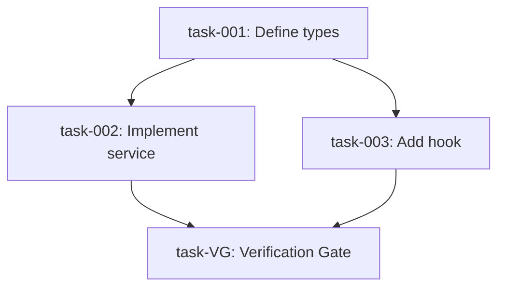

<objective>
Transform an issue into a set of focused, executable sub-tasks through deep codebase exploration. Each sub-task targets one logical unit of work (one coherent change that may span 1-4 closely related files), sized to fit within one Claude context window. Sub-tasks are created with blocking relationships to enable parallel work where dependencies allow.
</objective>

<context>
This skill bridges high-level issues and actionable implementation work. It:

1. **Deeply researches** the codebase to understand existing patterns, dependencies, and affected areas
2. **Decomposes** work into logical-unit tasks that Claude can complete in one session
3. **Identifies dependencies** between tasks to establish blocking relationships
4. **Writes sub-tasks locally** as JSON files in `.mobius/issues/{id}/tasks/` with proper blocking order

Sub-tasks are ALWAYS local files, regardless of backend mode. The backend only determines where the parent issue is fetched from. Sub-tasks are designed for autonomous execution - each should be completable without needing to reference other sub-tasks or gather additional context.
</context>

<backend_detection>
**Ask user which backend to use via AskUserQuestion if not obvious from issue ID format.**

**Auto-detection from issue ID**:
- Linear format: `MOB-123`, `VRZ-456` (typically 2-4 letter prefix)
- Jira format: `PROJ-123` (typically longer project key)
- Local format: `LOC-001`, `LOC-002` (auto-incremented local IDs)

If the format is ambiguous, use AskUserQuestion:

Question: "Which backend are you using?"

Options:
1. **Linear** - Fetch parent from Linear, write sub-tasks locally
2. **Jira** - Fetch parent from Jira, write sub-tasks locally
3. **Local** - Read parent from local file, write sub-tasks locally

Store the selection to use appropriate tools throughout the skill.

**Default**: If not specified, default to `linear`.

**Important**: Regardless of backend, sub-tasks are ALWAYS written as local JSON files to `.mobius/issues/{id}/tasks/`. The backend only affects how the parent issue is loaded.
</backend_detection>

<input_validation>
**Issue ID Validation**:
- Linear: `MOB-123`, `VRZ-456` (team prefix + number)
- Jira: `PROJ-123` (project key + number)
- Pattern: `/^[A-Z]{2,10}-\d+$/`

If issue ID doesn't match expected format, warn user before proceeding:

```
The issue ID "{id}" doesn't match the expected format ({backend} pattern).
Did you mean to use a different backend, or is this a valid issue ID?
```
</input_validation>

<parent_issue_loading>
**Fetch parent issue details based on backend mode.**

The backend determines where the parent issue is loaded from:

**For `backend: local`** - read from local file:

```bash
cat .mobius/issues/{issue-id}/parent.json
```

The local `parent.json` file is created by `/define` in local mode and contains:
- **Title and description**: What needs to be implemented
- **Acceptance criteria**: Checklist of requirements
- **Labels**: Bug/Feature/Improvement for context
- **Priority**: Urgency level for task ordering

If `parent.json` does not exist, report the error:
```
No local parent file found at .mobius/issues/{issue-id}/parent.json
Run /define {issue-id} first to create the issue spec, or check the issue ID.
```

**For `backend: linear`** — use `linearis issues read` CLI:

```bash
# Fetch issue details as JSON
linearis issues read MOB-123
```

**Extract from the response**:
- **Title and description**: What needs to be implemented
- **Acceptance criteria**: Checklist of requirements (look for checkbox patterns in description)
- **Labels**: Bug/Feature/Improvement for context
- **Priority**: Urgency level for task ordering
- **Team/Project**: For sub-task inheritance
- **Existing relationships**: blockedBy, blocks, relatedTo
- **URL**: For reference in sub-tasks

**For `backend: jira`** — use `acli jira workitem show`:

```bash
# Fetch issue details
acli jira workitem show PROJ-123
```

**Extract from the response**:
- **Summary and description**: What needs to be implemented
- **Issue type**: Bug/Story/Task for context
- **Priority**: Urgency level
- **Project key**: For sub-task inheritance
- **Issue links**: blocks, is blocked by relationships

**After loading (all backends)**: Write or update the local parent file for use by later skills:

```bash
mkdir -p .mobius/issues/{parent-id}
```

```
Write tool:
  file_path: .mobius/issues/{parent-id}/parent.json
  content: {parent issue JSON}
```

**If CLI command fails** (linear/jira backends):
1. Report the error to the user
2. If CLI not found, show install instructions:
   - Linear: `npm install -g linearis`
   - Jira: See https://developer.atlassian.com/cloud/acli/
3. Check if the issue ID is valid
4. Verify API permissions/authentication
5. Offer to retry or use a different issue ID
</parent_issue_loading>

<subtask_creation_local>
**Write sub-tasks as local JSON files after user approval.**

Sub-tasks are ALWAYS written locally to `.mobius/issues/{id}/tasks/` — never pushed to Linear/Jira. This applies to ALL backend modes (local, linear, jira).

**Directory setup**: Before writing files, ensure the tasks directory exists:

```bash
mkdir -p .mobius/issues/{parent-id}/tasks
```

**File naming**: Sub-task files use `task-{NNN}.json` format with zero-padded 3-digit numbers:
- `task-001.json`, `task-002.json`, ..., `task-010.json`
- Verification gate uses: `task-VG.json`

**Creation order**: Write sub-tasks in dependency order (leaf tasks first):
1. Write tasks with no blockers first
2. Use `task-{NNN}` identifiers for blocking references
3. Write dependent tasks with `blockedBy` referencing earlier task identifiers

**Sub-task JSON schema**:

```json
{
  "id": "task-001",
  "title": "[{parent-id}] {sub-task title}",
  "description": "## Summary\n{Brief description}\n\n## Context\nPart of {parent-id}: {parent title}\n\n## Target File(s)\n`{file-path}` ({Create/Modify})\n\n## Action\n{Specific implementation guidance}\n\n## Avoid\n- Do NOT {anti-pattern} because {reason}\n\n## Acceptance Criteria\n- [ ] {Criterion 1}\n  * **Verification**: {how to verify}\n- [ ] {Criterion 2}\n\n## Verify Command\n```bash\n{executable verification command}\n```",
  "status": "pending",
  "blockedBy": [],
  "blocks": ["task-002", "task-003"],
  "labels": ["{inherited-labels}"],
  "parentId": "{parent-id}"
}
```

**Write each sub-task using the Write tool**:

```
Write tool:
  file_path: .mobius/issues/{parent-id}/tasks/task-001.json
  content: {JSON content}
```

**Verification Gate creation** (always the last file):

```json
{
  "id": "task-VG",
  "title": "[{parent-id}] Verification Gate",
  "description": "Runs verify to validate implementation meets acceptance criteria. This is the ONLY task that runs the full test suite.\n\n**Blocked by**: ALL implementation sub-tasks\n**Action**: Run `/verify {parent-id}` after all implementation tasks complete\n\n### Aggregated Verify Commands\n1. task-001: Define types\n   ```bash\n   cd /path && bun run typecheck\n   ```\n2. task-002: Implement service\n   ```bash\n   cd /path && bun test service.test.ts\n   ```\n3. task-003: Add hook\n   ```bash\n   cd /path && bun run typecheck\n   ```",
  "status": "pending",
  "blockedBy": ["task-001", "task-002", "task-003"],
  "blocks": [],
  "labels": [],
  "parentId": "{parent-id}"
}
```

Write as: `.mobius/issues/{parent-id}/tasks/task-VG.json`

**Also update the context file** after writing all tasks:

```
Edit tool:
  file_path: .mobius/issues/{parent-id}/context.json
  # Update subTasks array with all created task references
```

Or if no context.json exists, create one:

```json
{
  "parent": {
    "id": "{parent-uuid}",
    "identifier": "{parent-id}",
    "title": "{parent title}",
    "description": "{parent description}",
    "status": "In Progress",
    "labels": ["{labels}"],
    "url": "{parent url}"
  },
  "subTasks": [
    {
      "id": "task-001",
      "identifier": "task-001",
      "title": "[{parent-id}] {sub-task title}",
      "status": "pending",
      "blockedBy": [],
      "blocks": ["task-002"]
    }
  ],
  "metadata": {
    "backend": "{linear|jira|local}",
    "fetchedAt": "{ISO-8601 timestamp}",
    "updatedAt": "{ISO-8601 timestamp}"
  }
}
```

**Error handling**:
- If file write fails (e.g., permission error), report and ask user to check directory permissions
- If directory creation fails, offer to create `.mobius/` manually
- All writes are atomic per-file so partial failure is safe
</subtask_creation_local>

<quick_start>
<invocation>
The skill expects an issue identifier as argument:

```
/refine MOB-123    # Linear issue (parent fetched from Linear, sub-tasks written locally)
/refine PROJ-456   # Jira issue (parent fetched from Jira, sub-tasks written locally)
/refine LOC-001    # Local issue (parent read from local file, sub-tasks written locally)
```

Or invoke programmatically:
```
Skill: refine
Args: MOB-123
```
</invocation>

<workflow>
1. **Detect backend** - Infer from issue ID format or ask user
2. **Fetch parent issue** - Load parent issue via CLI commands (linear/jira) or local file (local mode)
3. **Phase 1: Initial exploration** - Single Explore agent identifies affected areas, patterns, dependencies
4. **Phase 2: Identify work units** - Main agent groups affected files into sub-task-sized work units
5. **Phase 3: Per-task subagent research** - Spawn `feature-dev:code-architect` subagents (batched 3 at a time) to deep-dive and write complete sub-task descriptions
6. **Phase 4: Aggregate & present** - Collect subagent write-ups, establish dependency ordering, add verification gate, present full breakdown
7. **Gather feedback** - Use AskUserQuestion for refinement
8. **Phase 5: Write sub-tasks locally** - Write sub-task JSON files to `.mobius/issues/{id}/tasks/` directory
</workflow>
</quick_start>

<research_phase>
<load_parent_issue>
Fetch the parent issue based on detected backend:

**For `backend: local`** - read from local file:

```bash
cat .mobius/issues/{issue-id}/parent.json
```

Extract from the JSON: title, description, acceptance criteria, labels, priority.

**For `backend: linear`** — use `linearis issues read` CLI:

```bash
# Fetch issue details as JSON
linearis issues read {issue-id}  # e.g., "MOB-123"
```

**Extract from response**:
- **Title and description**: What needs to be implemented
- **Acceptance criteria**: Checklist of requirements (look for `- [ ]` patterns in description)
- **Labels**: Bug/Feature/Improvement for context
- **Priority**: Urgency level for task ordering
- **Team**: For sub-task inheritance (use same team for all sub-tasks)
- **Existing relationships**: blockedBy, blocks (to maintain)
- **URL**: For linking back to parent

**For `backend: jira`** — use `acli jira workitem show`:

```bash
# Fetch issue details
acli jira workitem show PROJ-123
```

**Extract from response**:
- **Summary and description**: What needs to be implemented
- **Issue type**: Bug/Story/Task for context
- **Priority**: Urgency level for task ordering
- **Project key**: For sub-task inheritance (use same project for all sub-tasks)
- **Issue links**: blocks, is blocked by (to maintain)
- **URL**: For linking back to parent

**After loading (all backends)**: Save parent data locally for use by execute/verify skills:

```bash
mkdir -p .mobius/issues/{parent-id}
```

```
Write tool:
  file_path: .mobius/issues/{parent-id}/parent.json
  content: {parent issue JSON}
```
</load_parent_issue>

<deep_exploration>
Use the Task tool with Explore agent to thoroughly analyze the codebase:

```
Task tool:
  subagent_type: Explore
  prompt: |
    Analyze the codebase to understand how to implement: {issue title and description}

    Research:
    1. Find all files that will need modification
    2. Understand existing patterns in similar areas
    3. Identify dependencies between affected files
    4. Note any shared utilities, types, or services involved
    5. Find test files that will need updates

    For each file, note:
    - What changes are needed
    - What it imports/exports that affects other files
    - Whether it has corresponding test files

    Provide a comprehensive analysis of the implementation approach.
```

Set thoroughness to "very thorough" for complex issues.
</deep_exploration>

<analysis_output>
From the exploration, extract:

- **Affected files**: Complete list with change type (create/modify)
- **Dependency graph**: Which files import from which
- **Shared resources**: Types, utilities, services used across files
- **Test requirements**: Which test files need updates
- **Pattern notes**: Existing conventions to follow
</analysis_output>

<work_unit_identification>
**Phase 2**: After Phase 1 exploration, the main agent groups findings into sub-task-sized work units.

**Process**:
1. Review the Explore agent's file list and dependency graph
2. Group files into work units following the logical-unit principle (1-4 related files per unit)
3. **Grouping heuristic**: Files that serve the same concern, are meaningless in isolation, always change together, or share all the same blockers/enablers should be combined into one work unit. A work unit producing fewer than ~30 lines is too small — merge it with a related unit.
4. For each work unit, note:
   - **Target file(s)**: The files in this logical unit (1-4 files)
   - **Rough scope**: Create / Modify / Delete, approximate change size
   - **Related areas**: Nearby files the subagent should examine for patterns and context
   - **Dependency hints**: Which other work units this one likely depends on or enables

**Output**: A list of work unit briefs, each feeding into a Phase 3 subagent.

**Example work unit brief**:
```
Work Unit 1: Theme infrastructure (types + context + hook)
  Target: src/types/theme.ts (Create), src/contexts/ThemeContext.tsx (Create), src/hooks/useTheme.ts (Create)
  Related: src/types/auth.ts (type patterns), src/contexts/AuthContext.tsx (context patterns), src/hooks/useAuth.ts (hook patterns)
  Scope: ~120 lines, new theme types + context provider + consuming hook
  Depends on: None (foundation)
  Enables: Work Units 2, 3 (components consuming the hook)
```
</work_unit_identification>
</research_phase>

<per_task_subagent_phase>
**Phase 3**: Spawn `feature-dev:code-architect` subagents to deep-dive each work unit and produce complete sub-task descriptions.

<subagent_batching>
**Batching rules**:
- Spawn up to **3 subagents simultaneously** per batch
- Wait for all subagents in a batch to complete before launching the next batch
- If a work unit depends on another's output (rare at this stage), place it in a later batch

**Example** (7 work units):
- Batch 1: Work Units 1, 2, 3 (parallel)
- Batch 2: Work Units 4, 5, 6 (parallel)
- Batch 3: Work Unit 7 (final)
</subagent_batching>

<subagent_prompt_template>
Each subagent receives the following context and returns a complete sub-task write-up:

```
Task tool:
  subagent_type: feature-dev:code-architect
  prompt: |
    You are writing a sub-task description for an implementation breakdown.

    ## Parent Issue
    Title: {parent issue title}
    Description: {parent issue description}
    Acceptance Criteria: {acceptance criteria from parent}

    ## Architecture Context (from Phase 1 exploration)
    {Paste the Explore agent's analysis output — affected files, patterns, dependency graph, conventions}

    ## Your Assigned Work Unit
    Target file(s): {target file path(s)} ({Create/Modify})
    Rough scope: {approximate change description}
    Related areas to examine: {nearby files for pattern reference}
    Dependency hints: Depends on {work unit N}, enables {work unit M}

    ## Your Task
    Analyze the target file(s) and related areas deeply. Then produce a complete sub-task description using this exact template:

    ## Summary
    {1-2 sentences: what this sub-task accomplishes}

    ## Context
    Part of {parent-id}: {parent title}

    ## Target File(s)
    `{file-path}` ({Create/Modify})

    ## Action
    {2-4 sentences of specific implementation guidance}
    - Use {library/pattern} following `{existing example file}`
    - Handle {error case} by {specific handling}
    - Return {exact output shape}

    ## Avoid
    - Do NOT {anti-pattern 1} because {reason}
    - Do NOT {anti-pattern 2} because {reason}

    ## Acceptance Criteria
    - [ ] {Criterion 1}
      * **Verification**: {how to verify}
    - [ ] {Criterion 2}
      * **Verification**: {how to verify}

    ## Verify Command
    ```bash
    {executable verification command}
    ```

    IMPORTANT: The verify command must use targeted tests only — specific test files or filtered test names. Do NOT use full test suite commands like `just test`, `npm test`, `bun test`, or unfiltered `cargo test`. Full test suite runs happen exclusively in the Verification Gate.

    ## Dependencies
    - **Blocked by**: {work unit numbers this depends on, or "None"}
    - **Enables**: {work unit numbers this unblocks}

    IMPORTANT: Be specific. Reference actual file paths, function names, and patterns you find in the codebase. Do not use generic placeholders.
```
</subagent_prompt_template>

<subagent_output_handling>
**Validation**: After each subagent returns, verify:
1. All template sections are present (Summary, Context, Target Files, Action, Avoid, Acceptance Criteria, Verify Command, Dependencies)
2. Target file paths are concrete (no placeholders)
3. Verify command is executable (not pseudocode)
4. Acceptance criteria are measurable

**On failure**:
- If a subagent returns incomplete or malformed output, retry once with a clarifying note
- If retry also fails, the main agent writes the sub-task description manually using Phase 1 exploration data
- Log which work units required fallback for debugging

**On success**:
- Store the write-up keyed by work unit number
- Pass all collected write-ups to Phase 4 (aggregation)
</subagent_output_handling>

For subagent pattern details, batching strategy, and rationale, see `.claude/skills/refine/parallel-research.md`.
</per_task_subagent_phase>

<decomposition_phase>
<logical_unit_principle>
Each sub-task should target one **logical unit of work**: a coherent change that may span 1-4 closely related files. A logical unit groups files that serve the same concern and are meaningless in isolation.

**Examples of logical units**:
- Types + context + hook for a single feature (theme infrastructure)
- A component and its co-located test file
- Multiple components undergoing the same mechanical change (adopting a new hook)
- A service, its types, and its test file

**Minimum size**: A sub-task should produce at least ~30 lines of changes. If it would be smaller, combine it with a related unit.

This ensures:
- Task fits within one context window (1-4 files is well within limits)
- Clear scope prevents scope creep while avoiding wasteful micro-tasks
- Easy to verify completion
- Enables parallel work on unrelated logical units
</logical_unit_principle>

<task_structure>
**Note**: In the standard flow, `feature-dev:code-architect` subagents (Phase 3) produce these sub-task descriptions. The main agent validates completeness and consistency during Phase 4 aggregation.

<task_structure_quick>
Each sub-task must include:
- **Target file(s)**: 1-4 files forming one logical unit
- **Action**: 2-4 sentences of specific implementation guidance
- **Verify**: Executable command that proves completion
- **Done**: 2-4 measurable outcomes as checklist
- **Blocked by / Enables**: Dependency relationships
</task_structure_quick>

<task_structure_full>
Full template for detailed sub-tasks:

```markdown
## Sub-task: [Number] - [Brief title]

**Target file(s)**: `path/to/file.ts` (and `path/to/file.test.ts` if applicable)
**Change type**: Create | Modify | Delete

### Action
[2-4 sentences of specific implementation guidance]
- Use {library/pattern} following `src/existing/example.ts`
- Handle {error case} by {specific handling}
- Return {exact output shape}

### Avoid
- Do NOT {anti-pattern 1} because {reason}
- Do NOT {anti-pattern 2} because {reason}

### Verify
```bash
{executable command that proves completion}
```
**Note**: Verify commands must use targeted tests only (specific files or filters). Never run the full test suite — that belongs exclusively in the Verification Gate.

### Done
- [ ] {Measurable outcome 1}
- [ ] {Measurable outcome 2}
- [ ] {Measurable outcome 3}

**Blocked by**: [Sub-task numbers, or "None"]
**Enables**: [Sub-task numbers this unblocks]
```

Use the "Avoid" section when research phase identified pitfalls specific to this task.
</task_structure_full>
</task_structure>

<ordering_principles>
Determine blocking order based on functional requirements:

1. **Foundation first**: Types, interfaces, schemas before implementations
2. **Dependencies flow down**: If A imports from B, B must be done first
3. **Tests with implementation**: Pair test files with their source files in same task
4. **UI last**: Components after their dependencies (services, hooks, types)
5. **Verification last**: The verification gate is ALWAYS the final sub-task

**Parallelization opportunities**:
- Independent services can run in parallel
- Unrelated UI components can run in parallel
- Tests for different features can run in parallel
</ordering_principles>

<aggregation_phase>
**Phase 4**: Collect all sub-task write-ups from Phase 3 subagents and assemble the final breakdown.

**Aggregation steps**:
1. **Collect write-ups** — Gather all sub-task descriptions from Phase 3 subagents (keyed by work unit number)
2. **Assign ordering numbers** — Use dependency hints from subagent outputs combined with ordering principles to assign sequential order numbers
3. **Establish blockedBy relationships** — Convert dependency hints into formal `blockedBy` references using assigned order numbers
4. **Verify no circular dependencies** — Walk the dependency graph to confirm it is a DAG (directed acyclic graph)
5. **Aggregate verify commands** — For each sub-task write-up from Phase 3 subagents, extract the `### Verify Command` bash code block and collect into a numbered list for the Verification Gate description:
   - Format each entry as: `{N}. {task-id}: {title}\n   ```bash\n   {verify command}\n   ```\n`
   - If a sub-task has no verify command, note: `{N}. {task-id}: {title}\n   (no verify command specified)`
   - Insert the collected list into the VG description's `### Aggregated Verify Commands` section
6. **Identify parallel groups** — Group tasks that share no mutual dependencies for concurrent execution
7. **Add verification gate** — Append the verification gate sub-task blocked by ALL implementation tasks, with the aggregated verify commands from step 5 included in its description
8. **Quality checks**:
   - Each sub-task targets one logical unit of work (1-4 related files)
   - No sub-task produces fewer than ~30 lines of changes
   - No duplicate target files across sub-tasks
   - All template sections are complete (Summary, Context, Target Files, Action, Avoid, Acceptance Criteria, Verify Command)
   - Verify commands are executable (not pseudocode)
   - Verify commands use targeted tests only (no `just test`, `npm test`, `bun test` without file pattern, `cargo test` without filter)
   - Acceptance criteria are measurable
   - Verification Gate description includes aggregated verify commands from all sub-tasks
</aggregation_phase>

<verification_gate>
**ALWAYS include a Verification Gate as the final sub-task.** This is required for every refined issue.

The verification gate:
- Has title: `[{parent-id}] Verification Gate` (MUST contain "Verification Gate" for mobius routing)
- Is blocked by ALL implementation sub-tasks
- When executed by mobius, routes to `/verify` instead of `/execute`
- Validates all acceptance criteria are met before the parent can be completed
- This is the ONLY place where the full test suite is run

**Template**:
```markdown
## Sub-task: [Final] - Verification Gate

**Target**: Validate implementation against acceptance criteria
**Change type**: Verification (no code changes)

### Action
This task triggers the verify skill to validate all implementation sub-tasks meet the parent issue's acceptance criteria.

### Aggregated Verify Commands
{List of each implementation sub-task's verify command, numbered by sub-task}

### Done
- [ ] All sub-task verify commands pass
- [ ] Full test suite passes (this is the exclusive place for full test runs)
- [ ] All acceptance criteria verified
- [ ] No critical issues found by code review agents

**Blocked by**: [ALL implementation sub-task IDs]
**Enables**: Parent issue completion
```

</verification_gate>

<sizing_guidelines>
A well-sized sub-task:

- Targets 1-4 files forming one logical unit of work
- Has 2-4 acceptance criteria
- Can be described in 2-3 sentences
- Takes roughly 50-200 lines of changes
- Doesn't require reading many other files to understand

**Minimum size**: Tasks producing fewer than ~30 lines of changes are too small. Combine them with related work.

**Split if**:
- Logical unit exceeds 4 files or ~200 lines of changes
- Description exceeds 5 sentences
- More than 5 acceptance criteria
- Changes span unrelated concerns (e.g., auth + UI styling)

**Combine if**:
- Files serve the same logical concern (types + context + hook for one feature)
- A file is meaningless without another (a context without its consuming hook)
- Task would produce fewer than ~30 lines of changes
- Files always change together (they have never been modified independently)
- Tasks share all the same blockers and enablers
</sizing_guidelines>

<context_sizing>
**Maximum 3 tasks per batch** to prevent context degradation.

<wave_triggers>
Create multiple waves when:
- More than 3 files affected in a single batch
- Changes span multiple subsystems (e.g., API + UI + database)
- Sub-task description exceeds 10 sentences
</wave_triggers>

<wave_structure>
For features requiring 4+ sub-tasks, organize into waves:

1. **Wave 1: Foundation** - Types, interfaces, schemas (max 3 tasks)
2. **Wave 2: Core Logic** - Services, API endpoints (max 3 tasks)
3. **Wave 3: UI/Presentation** - Components, forms (max 3 tasks)
4. **Wave 4: Integration** - Routing, E2E tests (remaining tasks)

**Batching rules**:
- Group related changes in same wave (e.g., service + its tests)
- Foundation tasks always in first wave
- Integration/E2E tasks always in final wave

See `<examples>` section for complete wave-based breakdown example.
</wave_structure>
</context_sizing>
</decomposition_phase>

<presentation_phase>
<breakdown_format>
Present the complete breakdown:

```markdown
# Implementation Breakdown: {Issue ID} - {Issue Title}

## Overview
- **Total sub-tasks**: {count}
- **Parallelizable groups**: {count}
- **Critical path**: {list of sequential dependencies}
- **Estimated scope**: {total files affected}

## Dependency Graph
```
[1] Types/Interfaces
 └─► [2] Service implementation
      ├─► [3] Hook implementation
      │    └─► [5] Component A
      └─► [4] Repository updates
           └─► [6] Component B

Parallel groups:
- Group 1: [1]
- Group 2: [2]
- Group 3: [3], [4]
- Group 4: [5], [6]
```

## Sub-tasks

### 1. Define TypeScript types for {feature}
**File**: `src/types/feature.ts`
**Blocked by**: None
**Enables**: 2, 3, 4

[Full sub-task details...]

### 2. Implement {feature} service
**File**: `src/lib/services/featureService.ts`
**Blocked by**: 1
**Enables**: 3, 4

[Full sub-task details...]

[Continue for all sub-tasks...]
```
</breakdown_format>

<refinement_questions>
After presenting the initial breakdown, use AskUserQuestion:

Question: "How would you like to proceed with this breakdown?"

Options:
1. **Create all sub-tasks** - Breakdown looks correct, create in issue tracker
2. **Adjust scope** - Some tasks need to be split or combined
3. **Change ordering** - Blocking relationships need adjustment
4. **Add context** - I have additional information to include
5. **Start over** - Need a different approach entirely
</refinement_questions>

<per_subtask_validation>
**For complex breakdowns (4+ sub-tasks), validate each sub-task interactively.**

For each sub-task, use AskUserQuestion to verify:

**Scope validation**:
```
Question: "Is the scope for sub-task {N} ({title}) correct?"
Options:
1. **Correct** - Scope is well-defined
2. **Too broad** - Should be split into smaller tasks
3. **Too narrow** - Can be combined with another task
4. **Needs clarification** - Requirements are unclear
```

**Edge case validation**:
```
Question: "What should happen if {operation} fails in sub-task {N}?"
Options:
1. **Throw error** - Fail fast with clear error message
2. **Return fallback** - Use default value and continue
3. **Retry** - Attempt operation again with backoff
4. **Not applicable** - This operation cannot fail
```

**Acceptance criteria validation**:
```
Question: "How should we verify sub-task {N} is complete?"
Options:
1. **Automated test** - Unit/integration test in CI
2. **Manual verification** - Human checks specific behavior
3. **Type checking** - TypeScript compilation succeeds
4. **All of the above** - Multiple verification methods
```
</per_subtask_validation>

<iterative_refinement>
If user selects adjustment options:

- **Adjust scope**: Ask which specific tasks to modify, then present revised breakdown
- **Change ordering**: Present dependency graph and ask which relationships to change
- **Add context**: Incorporate new information and re-analyze affected tasks

Loop back to presentation after each refinement until user approves.
</iterative_refinement>
</presentation_phase>

<output_phase>
<local_creation_process>
After user approval, write sub-task JSON files to `.mobius/issues/{parent-id}/tasks/`.

**Creation sequence**:

1. **Ensure directory exists**: `mkdir -p .mobius/issues/{parent-id}/tasks`
2. **Write leaf tasks first** (tasks with no blockers) as `task-001.json`, `task-002.json`, etc.
3. **Write dependent tasks** with `blockedBy` referencing earlier `task-{NNN}` identifiers
4. **Write Verification Gate last** as `task-VG.json` with all implementation task IDs as blockers
5. **Write context.json** with full parent + subTasks array for execute/verify skills
6. **Report progress** as each file is written

**Example creation flow**:
```
Writing sub-task 1/4: "Define TypeScript types"...
  -> Wrote .mobius/issues/MOB-100/tasks/task-001.json

Writing sub-task 2/4: "Implement feature service" (blocked by task-001)...
  -> Wrote .mobius/issues/MOB-100/tasks/task-002.json

Writing sub-task 3/4: "Add useFeature hook" (blocked by task-001)...
  -> Wrote .mobius/issues/MOB-100/tasks/task-003.json

Writing Verification Gate (blocked by task-001, task-002, task-003)...
  -> Wrote .mobius/issues/MOB-100/tasks/task-VG.json

Writing context.json...
  -> Wrote .mobius/issues/MOB-100/context.json

All sub-tasks written successfully!
```
</local_creation_process>

<completion_summary>
After writing all sub-task files locally, provide a summary:

```markdown
## Breakdown Complete: {parent issue ID}

**Sub-tasks created**: {count}
**Verification gate**: Included
**Location**: `.mobius/issues/{parent-id}/tasks/`

| ID | Title | Blocked By | File |
|----|-------|------------|------|
| task-001 | Define types | - | `tasks/task-001.json` |
| task-002 | Implement service | task-001 | `tasks/task-002.json` |
| task-003 | Add hook | task-001 | `tasks/task-003.json` |
| task-VG | Verification Gate | task-001, task-002, task-003 | `tasks/task-VG.json` |

**Ready to start**: task-001
**Parallel opportunities**: After task-001, task-002 and task-003 can run simultaneously

**Dependency Graph**:


Run `mobius loop {parent-id}` to begin execution, or `/execute {parent-id}` for a single task.
```
</completion_summary>

<post_creation_comment>
Optionally post the dependency graph as a comment on the parent issue (backend modes only):

**For `backend: linear`** — use `linearis comments create`:

```bash
COMMENT_BODY=$(cat <<'COMMENT'
## Sub-task Breakdown

| ID | Title | Blocked By |
|----|-------|------------|
| task-001 | Define types | - |
| task-002 | Implement service | task-001 |
| task-003 | Add hook | task-001 |
| task-VG | Verification Gate | task-001, task-002, task-003 |

**Ready to start**: task-001
**Local files**: `.mobius/issues/{parent-id}/tasks/`
COMMENT
)

linearis comments create {parent-issue-id} --body "$COMMENT_BODY"
```

**For `backend: jira`** — use `acli jira workitem comment add`:

```bash
COMMENT_BODY=$(cat <<'COMMENT'
## Sub-task Breakdown

| ID | Title | Blocked By |
|----|-------|------------|
| task-001 | Define types | - |
| task-002 | Implement service | task-001 |
| task-003 | Add hook | task-001 |
| task-VG | Verification Gate | task-001, task-002, task-003 |

**Ready to start**: task-001
**Local files**: `.mobius/issues/{parent-id}/tasks/`
COMMENT
)

acli jira workitem comment add --issue "{parent-issue-key}" --body "$COMMENT_BODY"
```

**For `backend: local`**: No comment posted (no remote issue tracker). The summary is displayed to the user in the terminal.
</post_creation_comment>
</output_phase>

<error_handling>
<cli_fetch_failure>
If parent issue fetch via CLI fails:

1. **Issue not found**:
   - Verify the issue ID is correct
   - Check if the issue exists in the tracker
   - Try with the full identifier (e.g., "MOB-123" not just "123")

2. **Permission denied**:
   - CLI may not be authenticated or may lack access to this issue
   - Check API token permissions in Linear/Jira settings
   - Verify the issue is not in a restricted project

3. **CLI not installed**:
   - Linearis CLI (`linearis`) not found — install via: `npm install -g linearis`
   - Jira CLI (`acli`) not found — see: https://developer.atlassian.com/cloud/acli/
   - Fall back to asking user to provide issue details manually

**Recovery**: Ask user if they want to retry, use a different issue ID, or provide details manually.
</cli_fetch_failure>

<local_file_write_failure>
If sub-task file creation fails:

1. **Directory creation failed**:
   - `.mobius/` directory may not be writable
   - Check file system permissions
   - Offer to create the directory manually

2. **File write failed**:
   - Disk may be full
   - Path may be invalid
   - Report which files were successfully written and which failed

3. **Partial write**:
   - Some task files may have been written before the failure
   - Report which files exist and which are missing
   - Offer to retry the failed writes

**Recovery options via AskUserQuestion**:
```
Question: "Sub-task file creation failed. How would you like to proceed?"
Options:
1. **Retry failed** - Attempt to write failed task files again
2. **Check permissions** - Verify .mobius/ directory is writable
3. **Cancel** - Don't write any more task files
```
</local_file_write_failure>
</error_handling>

<examples>
<example_breakdown backend="linear">
**Parent issue**: MOB-100 - Add dark mode support
**Backend**: Linear (Jira equivalent: PROJ-100)

**Exploration findings**:
- Need theme types in `src/types/theme.ts`
- ThemeProvider context in `src/contexts/ThemeContext.tsx`
- useTheme hook in `src/hooks/useTheme.ts`
- Settings toggle in `src/components/settings/ThemeToggle.tsx`
- Update 3 components that have hardcoded colors

**Breakdown**:

```markdown
## Sub-task: 1 - Theme infrastructure (types + context + hook)

**Target file(s)**:
- `src/types/theme.ts` (Create)
- `src/contexts/ThemeContext.tsx` (Create)
- `src/hooks/useTheme.ts` (Create)
**Change type**: Create
**Logical unit**: These three files form the theme infrastructure — types define the shape, context manages state, hook provides consumption API. They are meaningless in isolation.

### Action
Create the full theme infrastructure as one coherent unit:
1. Define `Theme` type (light/dark/system) and `ThemeContextValue` interface in types file
2. Create ThemeProvider context with localStorage persistence and system preference detection
3. Implement useTheme hook that consumes ThemeContext
- Follow existing type patterns in `src/types/`, context patterns in `src/contexts/`, hook patterns in `src/hooks/`

### Avoid
- Do NOT include implementation logic in types file because types should be pure declarations
- Do NOT call hooks conditionally because it violates React rules
- Do NOT forget SSR safety check for localStorage because window may not exist

### Verify
```bash
npx tsc --noEmit src/types/theme.ts src/contexts/ThemeContext.tsx src/hooks/useTheme.ts
```

### Done
- [ ] `Theme` type exported with 'light' | 'dark' | 'system' values
- [ ] `ThemeContextValue` interface exported with theme and setTheme properties
- [ ] ThemeProvider component exports and wraps children with localStorage persistence
- [ ] useTheme hook consumes ThemeContext and returns typed value
- [ ] All three files compile without TypeScript errors

**Blocked by**: None
**Enables**: 2, 3

---

## Sub-task: 2 - ThemeToggle component

**Target file(s)**: `src/components/settings/ThemeToggle.tsx` (Create)
**Change type**: Create

### Action
Create the ThemeToggle settings component. Import useTheme hook from sub-task 1 and render a toggle control for switching between light/dark/system modes.
- Follow existing component patterns in `src/components/settings/`

### Avoid
- Do NOT duplicate theme logic already in useTheme hook
- Do NOT hardcode color values — use theme context

### Verify
```bash
npx tsc --noEmit src/components/settings/ThemeToggle.tsx
```

### Done
- [ ] ThemeToggle component renders mode selector
- [ ] Consumes useTheme hook for state management
- [ ] File compiles without TypeScript errors

**Blocked by**: 1
**Enables**: None (parallel with 3)

---

## Sub-task: 3 - Update existing components for theme support

**Target file(s)**:
- `src/components/Header.tsx` (Modify)
- `src/components/Sidebar.tsx` (Modify)
- `src/components/Card.tsx` (Modify)
**Change type**: Modify
**Logical unit**: All three files undergo the same concern — replacing hardcoded colors with theme-aware values using the useTheme hook.

### Action
Update Header, Sidebar, and Card components to consume the useTheme hook and replace hardcoded color values with theme-aware equivalents.
- Import useTheme hook and apply theme values consistently across all three components
- Follow existing patterns for how components consume hooks

### Avoid
- Do NOT change component APIs or props — only internal color handling
- Do NOT add theme logic that belongs in the hook or context

### Verify
```bash
npx tsc --noEmit src/components/Header.tsx src/components/Sidebar.tsx src/components/Card.tsx
```

### Done
- [ ] Header.tsx uses theme context for colors
- [ ] Sidebar.tsx uses theme context for colors
- [ ] Card.tsx uses theme context for colors
- [ ] All three files compile without TypeScript errors

**Blocked by**: 1
**Enables**: None (parallel with 2)

---

## Sub-task: VG - Verification Gate

**Target**: Validate implementation against acceptance criteria
**Change type**: Verification (no code changes)

### Action
This task triggers the verify skill to validate all implementation sub-tasks meet the parent issue's acceptance criteria. This is the ONLY task that runs the full test suite.

### Done
- [ ] Full test suite passes (this is the exclusive place for full test runs)
- [ ] All acceptance criteria verified
- [ ] No critical issues found by code review agents

**Blocked by**: 1, 2, 3
**Enables**: Parent issue completion
```

**Dependency graph**:
```
[1] Theme infrastructure (types + context + hook)
     │
     ├─► [2] ThemeToggle component
     │
     └─► [3] Update existing components (Header, Sidebar, Card)
              │
     ┌────────┘
     ▼
[VG] Verification Gate (blocked by 1, 2, 3)
```

**Parallel groups**:
- [1] (foundation — must complete first)
- [2], [3] can run in parallel after [1]
- [VG] runs after ALL other tasks complete

**After user approval, write local task files**:

```bash
# Ensure directory exists
mkdir -p .mobius/issues/MOB-100/tasks
```

```
# Step 1: Write leaf task (no blockers) — theme infrastructure
Write tool:
  file_path: .mobius/issues/MOB-100/tasks/task-001.json
  content: {
    "id": "task-001",
    "title": "[MOB-100] Theme infrastructure (types + context + hook)",
    "description": "## Summary\nCreate theme types, ThemeProvider context, and useTheme hook as one logical unit...\n[full description]",
    "status": "pending",
    "blockedBy": [],
    "blocks": ["task-002", "task-003"],
    "parentId": "MOB-100"
  }

# Step 2: Write ThemeToggle task blocked by task-001
Write tool:
  file_path: .mobius/issues/MOB-100/tasks/task-002.json
  content: {
    "id": "task-002",
    "title": "[MOB-100] ThemeToggle component",
    "description": "## Summary\nCreate ThemeToggle settings component...",
    "status": "pending",
    "blockedBy": ["task-001"],
    "blocks": [],
    "parentId": "MOB-100"
  }

# Step 3: Write component updates task blocked by task-001
Write tool:
  file_path: .mobius/issues/MOB-100/tasks/task-003.json
  content: {
    "id": "task-003",
    "title": "[MOB-100] Update existing components for theme support",
    "description": "## Summary\nUpdate Header, Sidebar, Card to use theme context...",
    "status": "pending",
    "blockedBy": ["task-001"],
    "blocks": [],
    "parentId": "MOB-100"
  }

# Final: Write Verification Gate blocked by ALL
Write tool:
  file_path: .mobius/issues/MOB-100/tasks/task-VG.json
  content: {
    "id": "task-VG",
    "title": "[MOB-100] Verification Gate",
    "description": "Runs verify to validate implementation meets acceptance criteria. This is the ONLY task that runs the full test suite.",
    "status": "pending",
    "blockedBy": ["task-001", "task-002", "task-003"],
    "blocks": [],
    "parentId": "MOB-100"
  }

# Write context.json with full parent + subTasks array
Write tool:
  file_path: .mobius/issues/MOB-100/context.json
  content: { "parent": {...}, "subTasks": [...], "metadata": {...} }
```

**Report result to user**:

"## Breakdown Complete: MOB-100

**Sub-tasks created**: 4
**Location**: `.mobius/issues/MOB-100/tasks/`

| ID | Title | Files | Blocked By | File |
|----|-------|-------|------------|------|
| task-001 | Theme infrastructure | types + context + hook (3) | - | `tasks/task-001.json` |
| task-002 | ThemeToggle component | ThemeToggle.tsx (1) | task-001 | `tasks/task-002.json` |
| task-003 | Update existing components | Header, Sidebar, Card (3) | task-001 | `tasks/task-003.json` |
| task-VG | Verification Gate | - | task-001, task-002, task-003 | `tasks/task-VG.json` |

**Ready to start**: task-001
**Parallel opportunities**: After task-001, task-002 and task-003 can run simultaneously

Run `mobius loop MOB-100` to begin execution."
</example_breakdown>
</examples>

<anti_patterns>
**Don't create vague sub-tasks**:
- BAD: "Update components for dark mode"
- GOOD: "Update Header.tsx to use theme context for background and text colors"

**Don't skip the research phase**:
- BAD: Guess at file structure and create tasks
- GOOD: Deep exploration to understand actual codebase patterns

**Don't over-split**:
- BAD: Separate tasks for types, context, and hook that form one logical concern (theme infrastructure)
- BAD: A task that produces fewer than ~30 lines of changes
- BAD: Separate task for each function in a file
- GOOD: One task per logical unit — group tightly related files (types + context + hook) into a single task

**Don't under-split**:
- BAD: "Implement entire feature" as one task spanning 8+ files
- GOOD: One task per logical unit (1-4 related files), each independently completable

**Don't ignore existing patterns**:
- BAD: Create tasks that introduce new patterns
- GOOD: Research existing conventions and match them

**Don't create circular dependencies**:
- BAD: Task A blocks B, B blocks C, C blocks A
- GOOD: Clear hierarchical dependency flow

**Don't run full test suites in sub-task verify commands**:
- BAD: `just test`, `npm test`, `bun test` (runs everything)
- BAD: `cargo test` (runs entire crate's tests)
- GOOD: `bun test src/hooks/useTheme.test.ts` (targeted file)
- GOOD: `cargo test theme` (filtered by name)
- Full test suite runs belong exclusively in the Verification Gate.
</anti_patterns>

<success_criteria>
A successful refinement produces:

- [ ] Backend detected from issue ID format or user input
- [ ] Parent issue fetched via CLI command (linear/jira) or local file (local mode)
- [ ] All affected files identified through deep exploration
- [ ] Each sub-task targets one logical unit of work (1-4 related files)
- [ ] No sub-task produces fewer than ~30 lines of changes
- [ ] Every sub-task has clear, verifiable acceptance criteria
- [ ] Each sub-task validated with user via AskUserQuestion (for complex breakdowns)
- [ ] Blocking relationships are logically sound
- [ ] No circular dependencies exist
- [ ] Parallel opportunities are maximized
- [ ] Ready tasks (no blockers) are clearly identified
- [ ] **Verification Gate included as final task** (`task-VG.json`)
- [ ] Verification Gate blocked by ALL implementation sub-tasks
- [ ] User approved breakdown before creation
- [ ] Sub-task files written to `.mobius/issues/{id}/tasks/` as `task-{NNN}.json`
- [ ] `context.json` written with full parent + subTasks array
- [ ] Blocking relationships captured in JSON `blockedBy`/`blocks` arrays
- [ ] Summary with dependency graph provided
</success_criteria>

<testing>
**Manual integration testing** for verifying the refine skill works end-to-end.

<verification_steps>
After running `/refine {issue-id}`, verify the results.

<local_file_verification>
**Local file verification**:

1. **Directory exists**: `.mobius/issues/{parent-id}/tasks/` directory was created
2. **Task files written**: Each `task-{NNN}.json` file contains valid JSON
3. **Verification gate**: `task-VG.json` exists and is blocked by all implementation tasks
4. **Context file**: `.mobius/issues/{parent-id}/context.json` exists with correct subTasks array
5. **Blocking relationships**: Each task's `blockedBy` array references valid task IDs
</local_file_verification>

<parent_fetch_verification>
**Parent issue fetch verification** (backend-dependent):

- **Local mode**: Verify `.mobius/issues/{id}/parent.json` was read successfully
- **Linear mode**: Verify `linearis issues read` CLI returned expected data
- **Jira mode**: Verify `acli jira workitem show` CLI returned expected data
</parent_fetch_verification>
</verification_steps>

<troubleshooting>
**Common errors and solutions**:

<cli_not_installed>
**CLI tool not available**
```
Error: linearis: command not found
```

**Cause**: Linearis CLI or Jira CLI not installed.

**Solution**:
1. Install Linearis CLI: `npm install -g linearis`
2. Install Jira CLI: See https://developer.atlassian.com/cloud/acli/
3. Verify installation with `command -v linearis` or `command -v acli`
4. Ensure CLI is authenticated (set `LINEAR_API_TOKEN` env var)
</cli_not_installed>

<issue_not_found>
**Issue not found**
```
Error: Issue MOB-999 not found
```

**Cause**: The issue ID doesn't exist or user doesn't have access.

**Solution**:
1. Verify the issue ID is correct
2. Check if the issue exists in Linear/Jira
3. Verify API token has access to the project/team
</issue_not_found>

<file_write_failed>
**Sub-task file write failed**
```
Error: Failed to write file .mobius/issues/{id}/tasks/task-001.json
```

**Cause**: Permission issue, missing directory, or disk full.

**Solution**:
1. Check `.mobius/` directory exists and is writable
2. Verify disk space is available
3. Try creating the directory manually: `mkdir -p .mobius/issues/{id}/tasks`
4. Review the error message for specific details
</file_write_failed>
</troubleshooting>

<end_to_end_test>
**Complete end-to-end verification checklist**:

1. **Setup**:
   - [ ] Backend configured (linear, jira, or local)
   - [ ] For linear/jira: CLI tools installed and authenticated
   - [ ] Test parent issue exists (in tracker or as local file)

2. **Run refine**:
   - [ ] Execute `/refine {test-issue-id}` on a test issue
   - [ ] Observe parent issue fetched (via CLI or local file)
   - [ ] Review the breakdown presentation
   - [ ] Validate each sub-task scope via AskUserQuestion (if prompted)
   - [ ] Approve the breakdown when prompted

3. **Verify local file creation**:
   - [ ] `.mobius/issues/{id}/tasks/` directory exists
   - [ ] Each `task-{NNN}.json` file contains valid JSON with correct schema
   - [ ] `task-VG.json` exists as Verification Gate
   - [ ] `context.json` written with correct subTasks array
   - [ ] Blocking relationships (`blockedBy`/`blocks`) are consistent
   - [ ] Progress reported as files are written

4. **Verify execution compatibility**:
   - [ ] `mobius loop {parent-id}` or `/execute {parent-id}` reads local task files
   - [ ] Blocked tasks cannot start until blockers complete
   - [ ] Verification Gate executes last after all implementation tasks
</end_to_end_test>
</testing>
