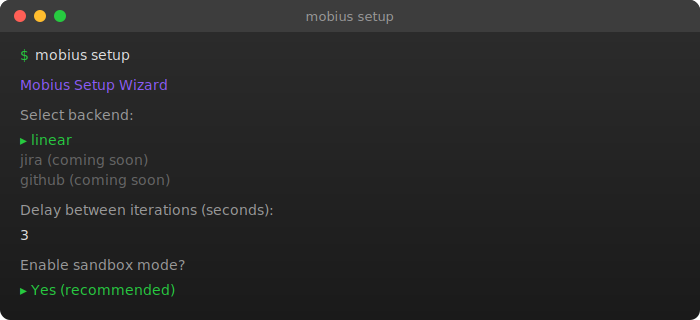
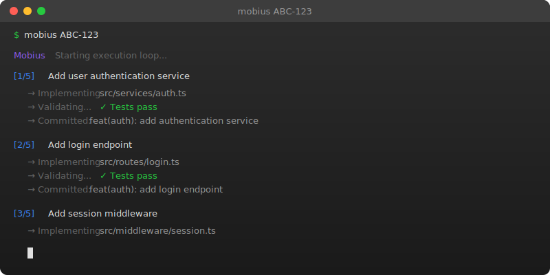

<div align="center">

```
███╗   ███╗ ██████╗ ██████╗ ██╗██╗   ██╗███████╗
████╗ ████║██╔═══██╗██╔══██╗██║██║   ██║██╔════╝
██╔████╔██║██║   ██║██████╔╝██║██║   ██║███████╗
██║╚██╔╝██║██║   ██║██╔══██╗██║██║   ██║╚════██║
██║ ╚═╝ ██║╚██████╔╝██████╔╝██║╚██████╔╝███████║
╚═╝     ╚═╝ ╚═════╝ ╚═════╝ ╚═╝ ╚═════╝ ╚══════╝
```

**Autonomous AI development that works with your existing workflow.**

**Define issues in Linear or Jira. Let Claude implement them. Review and ship.**

[](https://www.npmjs.com/package/mobius-loop)
[](LICENSE)
[](https://nodejs.org/)

<br>

```bash
npm install -g mobius-loop && mobius setup
```

**Works on Mac, Windows, and Linux.**

</div>

---

## Table of Contents

- [The Problem](#the-problem)
- [Why Mobius?](#why-mobius)
- [Workflow Lifecycle](#workflow-lifecycle)
- [TUI Dashboard](#tui-dashboard)
- [Quick Start](#quick-start)
- [The 4 Skills](#the-4-skills)
- [The Execution Loop](#the-execution-loop)
- [Parallel Execution](#parallel-execution)
- [Configuration](#configuration)
- [Jira Setup](#jira-setup)
- [Switching Backends](#switching-backends)
- [Backend Architecture](#backend-architecture)
- [Project Setup](#project-setup-agentsmd)
- [Sandbox Mode](#sandbox-mode)
- [Requirements](#requirements)
- [Environment Variables](#environment-variables)
- [CLI Reference](#cli-reference)
- [Troubleshooting](#troubleshooting)

---

## The Problem

AI-assisted coding has a coordination problem:

- **Context amnesia** — Every session starts from scratch, losing prior decisions
- **Manual orchestration** — You become the glue between AI and your issue tracker
- **Team blindness** — No visibility into what AI is doing or has done
- **Scope creep** — Without guardrails, AI changes spiral beyond the original ask
- **Risky autonomy** — Letting AI run unattended feels dangerous

---

## Why Mobius?

Mobius takes a fundamentally different approach to AI-assisted development. Instead of feeding entire codebases into a single context window, Mobius breaks work into **focused sub-tasks** that each operate with minimal context. This design unlocks several compounding benefits:

### 💰 Lower API Costs

Focused sub-tasks mean lower API costs. Each sub-task runs with only the context it needs—typically a single file plus its dependencies. This means:
- **Smaller prompts** = fewer tokens per request
- **Targeted reads** = no wasted context on irrelevant code
- **Efficient iterations** = rapid feedback without re-processing entire codebases

A typical sub-task uses 5-10x fewer tokens than a monolithic prompt that loads "everything just in case."

### 🎯 Higher Accuracy

Focused context leads to higher accuracy. Precise implementations result from:
- **Less noise** = Claude concentrates on the task at hand
- **Clearer boundaries** = acceptance criteria define exactly what "done" means
- **Single-file scope** = changes stay contained, reducing unintended side effects

When you tell Claude "modify this one file to add this one feature," it delivers exactly that—not a sprawling refactor.

### ⚡ Parallel Execution

Mobius enables parallel execution for faster development. Sub-tasks without dependencies run simultaneously:
- **Multiple Claude agents** work in parallel (up to 10)
- **Git worktree isolation** prevents conflicts between agents
- **Dependency-aware scheduling** ensures tasks execute in correct order
- **Real-time TUI dashboard** shows all agents working at once

What would take hours sequentially completes in a fraction of the time.

### 👥 Team Visibility

State lives in your issue tracker, not hidden files:
- **Linear/Jira integration** = your team sees exactly what's happening
- **No context amnesia** = stop and resume anytime without losing progress
- **Audit trail** = every sub-task has commits, comments, and status updates
- **Works with existing workflow** = no new systems to learn

Your team already knows Linear or Jira. Mobius just makes it smarter.

### 🔒 Safe Autonomous Execution

Let Claude work unattended with confidence:
- **Docker sandbox** isolates file system changes by default
- **Scoped permissions** = each sub-task can only modify its target files
- **Verification gates** = tests, typecheck, and lint must pass before commit
- **Easy rollback** = each sub-task is a separate commit

Run `mobius loop ABC-123` overnight. Wake up to a PR ready for review.

---

## Workflow Lifecycle

The complete Mobius workflow transforms an idea into a merged PR through 5 structured steps. Each step builds on the previous, maintaining traceability from requirements to implementation.

<p align="center">
  
</p>

### Step 1: `/define` — Create the Issue

Use Socratic questioning to create a well-defined issue with clear acceptance criteria. Claude asks clarifying questions to ensure the issue is specific, measurable, and implementable.

```bash
claude "/define"
```

**Expected output:**
- New issue created in Linear/Jira with title, description, and acceptance criteria
- Issue linked with appropriate labels and priority
- Clear "done" conditions that can be verified

📄 [Skill documentation](.claude/skills/define-issue/SKILL.md)

---

### Step 2: `/refine` — Break into Sub-tasks

Analyzes your codebase and decomposes the issue into focused sub-tasks. Each sub-task targets a single file (or source + test pair) with explicit blocking dependencies.

```bash
claude "/refine ABC-123"
```

**Expected output:**
- Sub-tasks created as child issues in Linear/Jira
- Each sub-task specifies target file(s) and change type
- Blocking relationships define execution order
- Task dependency graph posted as a Mermaid diagram comment

📄 [Skill documentation](.claude/skills/refine-issue/SKILL.md)

---

### Step 3: `mobius loop` — Execute with Parallel Agents

Runs the autonomous execution loop with parallel Claude agents. Unblocked sub-tasks execute simultaneously in isolated git worktrees with real-time TUI dashboard monitoring.

```bash
mobius loop ABC-123              # Parallel execution (default)
mobius loop ABC-123 --parallel=5 # Up to 5 concurrent agents
mobius ABC-123 --sequential      # Sequential fallback
```

**Expected output:**
- Git worktree created for isolated execution
- Sub-tasks executed in dependency order
- Each sub-task: implement → verify → commit → push
- Progress visible in TUI dashboard
- Worktree cleaned up on success

📄 [Skill documentation](.claude/skills/execute-issue/SKILL.md)

---

### Step 4: `/verify` — Validate Against Criteria

Reviews the complete implementation against the original acceptance criteria. Runs final validation, compares changes to requirements, and adds review notes.

```bash
claude "/verify ABC-123"
```

**Expected output:**
- Each acceptance criterion checked and marked pass/fail
- Test suite execution results
- Review notes added as issue comment
- Issue marked complete if all criteria pass

📄 [Skill documentation](.claude/skills/verify-issue/SKILL.md)

---

### Step 5: `mobius submit` — Create the PR

Creates a pull request with proper formatting, linked issues, and a summary of all changes. Merges all sub-task commits into a reviewable PR.

```bash
mobius submit ABC-123
```

**Expected output:**
- Pull request created with structured description
- Sub-task issues linked in PR body
- Commit history preserved for traceability
- Ready for human review and merge

📄 [Skill documentation](.claude/skills/pr/SKILL.md)

---

## TUI Dashboard

The TUI (Terminal User Interface) Dashboard provides real-time visualization of parallel agent execution. It appears automatically when you run `mobius loop`.

```bash
mobius loop MOB-123
```

### Key Features

| Feature | Description |
|---------|-------------|
| **Task Tree** | Hierarchical view of all sub-tasks with dependency relationships and current status |
| **Agent Panel Grid** | Live output from up to 4 parallel Claude agents working simultaneously |
| **Elapsed Time Tracking** | Per-task and total execution time displayed in real-time |
| **Process Health Monitoring** | Visual indicators showing agent process status (active/stalled) |
| **Auto-Exit** | Dashboard automatically exits when all tasks complete (2s delay to review) |

### Dashboard Layout

```
┌─────────────────────────────────────────────────────────────────────────┐
│  Task Tree for MOB-123:                                    [00:05:32]   │
│  ├── [✓] MOB-124: Setup base types                                      │
│  ├── [✓] MOB-125: Create utility functions                              │
│  ├── [⟳] MOB-126: Implement parser (blocked by: MOB-124, MOB-125)       │
│  │   └── [·] MOB-127: Add tests (blocked by: MOB-126)                   │
│  ├── [⟳] MOB-128: Build CLI interface (blocked by: MOB-125)             │
│  └── [·] MOB-129: Integration tests (blocked by: MOB-126, MOB-128)      │
├─────────────────────────────────┬───────────────────────────────────────┤
│ MOB-126                         │ MOB-128                               │
│      ⠋ Running                  │      ⠋ Running                        │
│      2m 34s                     │      1m 12s                           │
│      Process: active            │      Process: active                  │
├─────────────────────────────────┼───────────────────────────────────────┤
│ (available)                     │ (available)                           │
│      Ready for work             │      Ready for work                   │
├─────────────────────────────────────────────────────────────────────────┤
│  Legend: [✓] Done  [→] Ready  [·] Blocked  [⟳] In Progress  [✗] Failed  │
└─────────────────────────────────────────────────────────────────────────┘
```

### Status Icons

| Icon | Status | Meaning |
|------|--------|---------|
| `[✓]` | Done | Task completed successfully |
| `[→]` | Ready | All blockers resolved, ready for execution |
| `[·]` | Blocked | Waiting on other tasks to complete |
| `[⟳]` | In Progress | Currently being executed by an agent |
| `[✗]` | Failed | Task failed verification |

### TUI Configuration

Configure the TUI in `~/.config/mobius/config.yaml`:

```yaml
execution:
  tui:
    show_legend: true       # Show status legend at bottom (default: true)
    panel_lines: 8          # Lines per agent panel (default: 8)
    panel_refresh_ms: 300   # Agent output refresh rate in ms (default: 300)
```

### Keyboard Controls

| Key | Action |
|-----|--------|
| `q` | Exit immediately (when execution complete) |
| `Enter` / `Space` | Exit immediately (when execution complete) |

The TUI automatically exits 2 seconds after all tasks complete, giving you time to review the final status.

---

## Quick Start

Get from zero to executing your first issue:

```bash
npm install -g mobius-loop
mobius setup
mobius ABC-123
```

<p align="center">
  
</p>

<details>
<summary>Alternative installation methods</summary>

### Manual Installation

```bash
git clone https://github.com/Tubular-Health/mobius.git
cd mobius
./install.sh
```

The installer places:
- `mobius` command in `~/.local/bin/`
- Config at `~/.config/mobius/config.yaml`
- Claude skills in `~/.claude/skills/`

Ensure `~/.local/bin` is in your PATH:
```bash
export PATH="$HOME/.local/bin:$PATH"
```

</details>

---

## The 4 Skills

Mobius provides four unified skills for the complete issue lifecycle, supporting both Linear and Jira backends. The skills automatically detect your configured backend and use the appropriate API.

<details>
<summary><code>/define</code> — Create well-defined issues</summary>

Through Socratic questioning, Claude helps you create issues with:
- Clear title and description
- Measurable acceptance criteria
- Appropriate labels and priority

```bash
claude "/define"
```

Works with both Linear and Jira based on your `backend` config setting.

</details>

<details>
<summary><code>/refine</code> — Break into sub-tasks</summary>

Analyzes your codebase and creates sub-tasks that are:
- Small enough for single-file focus
- Ordered with blocking dependencies
- Detailed with specific files and changes

```bash
claude "/refine ABC-123"    # Linear
claude "/refine PROJ-123"   # Jira
```

</details>

<details>
<summary><code>/execute</code> — Implement one sub-task</summary>

Executes the next ready sub-task:
1. Reads parent issue context
2. Implements the change
3. Runs validation commands
4. Commits and pushes
5. Marks sub-task complete

```bash
claude "/execute ABC-123"
```

Or use the CLI for continuous execution:
```bash
mobius ABC-123
```

</details>

<details>
<summary><code>/verify</code> — Validate completion</summary>

Reviews implementation against acceptance criteria:
- Compares changes to requirements
- Runs final validation
- Adds review notes as issue comment
- Marks issue complete if passing

```bash
claude "/verify ABC-123"
```

</details>

### Backend-Specific Aliases

For explicit backend selection, you can also use:

| Unified Command | Linear Alias | Jira Alias |
|-----------------|--------------|------------|
| `/define` | `/linear:define` | `/jira:define` |
| `/refine` | `/linear:refine` | `/jira:refine` |
| `/execute` | `/linear:execute` | `/jira:execute` |
| `/verify` | `/linear:verify` | `/jira:verify` |

---

## The Execution Loop

When you run `mobius ABC-123`, here's what happens:

<p align="center">
  
</p>

```
do {
    task = findNextReady(issue)      // Respects blockedBy dependencies

    implement(task)                   // Single-file focus per sub-task

    validate()                        // Tests, typecheck, lint

    commit()                          // Descriptive message, push

    markComplete(task)                // Update Linear status

} while (hasReadyTasks(issue))
```

<p align="center">
  
</p>

**Stop anytime. Resume later.** State lives in Linear, not local files.

---

## Parallel Execution

Mobius supports parallel sub-task execution with git worktree isolation. When sub-tasks have no blocking dependencies, multiple Claude agents work simultaneously.

### How It Works

```
mobius loop MOB-123
    ↓
1. Creates git worktree at ../mobius-worktrees/MOB-123/
2. Creates feature branch off main
3. Builds task dependency graph from Linear
4. Spawns N parallel agents for unblocked tasks
5. Agents share worktree, git operations serialized
6. Loop continues until all tasks complete
7. Worktree cleaned up on success
```

### Task Dependency Visualization

Before execution, Mobius displays the task tree in your terminal:

```
Task Tree for MOB-123:
├── [✓] MOB-124: Setup base types
├── [✓] MOB-125: Create utility functions
├── [→] MOB-126: Implement parser (blocked by: MOB-124, MOB-125)
│   └── [·] MOB-127: Add tests (blocked by: MOB-126)
├── [→] MOB-128: Build CLI interface (blocked by: MOB-125)
└── [·] MOB-129: Integration tests (blocked by: MOB-126, MOB-128)

Legend: [✓] Done  [→] Ready  [·] Blocked  [!] In Progress
Ready for parallel execution: MOB-126, MOB-128 (2 agents)
```

A Mermaid diagram is also posted to the parent Linear issue for team visibility.

### Commands

```bash
mobius loop MOB-123             # Parallel execution (default)
mobius loop MOB-123 --parallel=5  # Override max parallel agents
mobius MOB-123 --sequential     # Sequential execution (bash loop)
```

### Configuration

| Option | Default | Environment Variable | Description |
|--------|---------|---------------------|-------------|
| `max_parallel_agents` | `3` | `MOBIUS_MAX_PARALLEL_AGENTS` | Maximum concurrent Claude agents (1-10) |
| `worktree_path` | `../<repo>-worktrees/` | `MOBIUS_WORKTREE_PATH` | Base directory for worktrees |
| `cleanup_on_success` | `true` | `MOBIUS_CLEANUP_ON_SUCCESS` | Auto-remove worktree on success |
| `base_branch` | `main` | `MOBIUS_BASE_BRANCH` | Branch for feature branches |

### Requirements

- **tmux** - Required for parallel execution display
  - macOS: `brew install tmux`
  - Linux: `apt install tmux`

If tmux is unavailable, use `--sequential` for bash-based execution.

---

## Configuration

<details>
<summary>View configuration options</summary>

### Config File

Edit `~/.config/mobius/config.yaml`:

```yaml
# Issue tracker backend: linear | jira
backend: linear

# Linear configuration (default)
linear:
  # Uses Linear MCP tools (auto-configured via Claude Code)
  # No additional configuration required

# Jira configuration (uncomment when using Jira)
# jira:
#   base_url: https://your-org.atlassian.net
#   project_key: PROJ
#   auth_method: api_token

execution:
  delay_seconds: 3
  max_iterations: 50
  model: opus
  sandbox: true
  container_name: mobius-sandbox

  # Parallel execution settings
  max_parallel_agents: 3
  worktree_path: "../<repo>-worktrees/"
  cleanup_on_success: true
  base_branch: "main"
```

### Environment Variables

Override any setting with environment variables:

```bash
export MOBIUS_BACKEND=linear
export MOBIUS_DELAY_SECONDS=5
export MOBIUS_MAX_ITERATIONS=100
export MOBIUS_MODEL=sonnet
export MOBIUS_SANDBOX_ENABLED=false

# Parallel execution settings
export MOBIUS_MAX_PARALLEL_AGENTS=5
export MOBIUS_WORKTREE_PATH="../custom-worktrees/"
export MOBIUS_CLEANUP_ON_SUCCESS=false
export MOBIUS_BASE_BRANCH=develop
```

### Commands

```bash
mobius config          # Show current configuration
mobius config --edit   # Open config in editor
```

</details>

---

## Jira Setup

<details>
<summary>Configure Mobius for Jira</summary>

### 1. Update Configuration

Edit `~/.config/mobius/config.yaml`:

```yaml
backend: jira

jira:
  base_url: https://your-org.atlassian.net
  project_key: PROJ
  auth_method: api_token
```

### 2. Generate API Token

1. Go to [Atlassian Account Settings](https://id.atlassian.com/manage-profile/security/api-tokens)
2. Click **Create API token**
3. Give it a name (e.g., "Mobius")
4. Copy the generated token

### 3. Set Environment Variable

```bash
export JIRA_API_TOKEN="your-api-token-here"

# Add to your shell profile for persistence
echo 'export JIRA_API_TOKEN="your-api-token-here"' >> ~/.bashrc
```

### 4. Configure Claude MCP Plugin

The Jira MCP plugin must be configured in your Claude Code settings. Add to your MCP configuration:

```json
{
  "mcpServers": {
    "jira": {
      "command": "npx",
      "args": ["-y", "@anthropic/mcp-server-jira"],
      "env": {
        "JIRA_BASE_URL": "https://your-org.atlassian.net",
        "JIRA_EMAIL": "your-email@company.com",
        "JIRA_API_TOKEN": "${JIRA_API_TOKEN}"
      }
    }
  }
}
```

### 5. Verify Setup

```bash
mobius doctor
```

This will confirm Jira connectivity and MCP plugin availability.

### Example Jira Workflow

```bash
# Define a new Jira issue
claude "/define"

# Break down into sub-tasks
claude "/refine PROJ-123"

# Execute sub-tasks (parallel by default)
mobius loop PROJ-123

# Verify implementation
claude "/verify PROJ-123"
```

</details>

---

## Switching Backends

<details>
<summary>How to switch between Linear and Jira</summary>

### Global Switch

Change the `backend` setting in your config:

```yaml
# ~/.config/mobius/config.yaml
backend: jira  # or 'linear'
```

### Per-Session Switch

Use environment variable to override:

```bash
# Use Jira for this session
MOBIUS_BACKEND=jira mobius PROJ-123

# Use Linear for this session
MOBIUS_BACKEND=linear mobius ABC-123
```

### Per-Project Configuration

Create a `mobius.config.yaml` in your project root to override the global config:

```yaml
# /path/to/project/mobius.config.yaml
backend: jira

jira:
  base_url: https://your-org.atlassian.net
  project_key: MYPROJ
```

Project-level config takes precedence over global config.

### Backend Detection Order

Mobius determines the backend in this order:
1. `MOBIUS_BACKEND` environment variable
2. `mobius.config.yaml` in project root
3. `~/.config/mobius/config.yaml`
4. Default: `linear`

</details>

---

## Backend Architecture

<p align="center">
  
</p>

Mobius uses a skill-based architecture that abstracts the issue tracker. **Both Linear and Jira are fully supported** through unified skills that detect your configured backend.

The unified skills at `.claude/skills/` use progressive disclosure to provide backend-specific MCP tool documentation while keeping workflow logic backend-agnostic:

| Backend | Status | MCP Plugin |
|---------|--------|------------|
| **Linear** | Supported | `@anthropic/mcp-server-linear` |
| **Jira** | Supported | `@anthropic/mcp-server-jira` |
| GitHub Issues | Planned | — |

---

## Project Setup: AGENTS.md

Copy the template to your project root to provide context each iteration:

```bash
cp /path/to/mobius/templates/AGENTS.md ./AGENTS.md
```

This file tells Claude about your project:
- Build and validation commands
- Codebase patterns and conventions
- Common issues and solutions
- Files that should not be modified

<details>
<summary>Example AGENTS.md</summary>

```markdown
## Build & Validation

- **Tests:** `npm test`
- **Typecheck:** `npm run typecheck`
- **Lint:** `npm run lint`

## Codebase Patterns

- Components: `src/components/` - React, PascalCase
- Services: `src/services/` - Business logic
- Tests: `__tests__/` directories, `.spec.ts` suffix

## Common Issues

- Always reset mocks in `beforeEach`
- Use absolute imports from `@/`
```

</details>

---

## Sandbox Mode

By default, Mobius runs Claude in a Docker container for safer autonomous execution. This isolates file system changes and prevents accidental damage to your system.

```bash
# Run in sandbox (default)
mobius ABC-123

# Run locally (bypass sandbox)
mobius ABC-123 --local
```

To disable sandbox permanently:
```yaml
execution:
  sandbox: false
```

---

## Requirements

| Requirement | Notes |
|-------------|-------|
| **Node.js 18+** | For npm installation |
| **Claude Code CLI** | Install from [claude.ai/code](https://claude.ai/code) |
| **Git** | Required for worktree operations; remote must be configured |
| **Linear or Jira account** | Both backends fully supported |
| **tmux** (optional) | Required for parallel execution; use `--sequential` without it |
| **Docker** (optional) | For sandbox mode |

---

## Environment Variables

| Variable | Backend | Required | Description |
|----------|---------|----------|-------------|
| `LINEAR_API_KEY` | linear | Yes | API key from [Linear Settings > API](https://linear.app/settings/api) |
| `JIRA_API_TOKEN` | jira | Yes | API token from [Atlassian Account Settings](https://id.atlassian.com/manage-profile/security/api-tokens) |
| `JIRA_EMAIL` | jira | Yes | Email address associated with your Atlassian account |

Set environment variables in your shell profile:
```bash
export LINEAR_API_KEY="lin_api_xxxxx"
# or for Jira:
export JIRA_API_TOKEN="your-api-token"
export JIRA_EMAIL="you@company.com"
```

---

## CLI Reference

```bash
# Parallel execution (default)
mobius loop ABC-123              # Run parallel loop until complete
mobius loop ABC-123 --parallel=5 # Override max parallel agents
mobius ABC-123                   # Alias for parallel loop

# Sequential execution
mobius ABC-123 --sequential      # Use bash sequential loop
mobius ABC-123 10                # Limit to 10 iterations
mobius ABC-123 --local           # Bypass sandbox
mobius ABC-123 --model=sonnet    # Use specific model

# Management commands
mobius setup                     # Interactive setup wizard
mobius config                    # Show configuration
mobius config --edit             # Edit configuration
mobius doctor                    # Check system requirements
mobius --help                    # Show help
```

---

## Troubleshooting

<details>
<summary>Common issues and solutions</summary>

### "Claude CLI not found"

Install Claude Code CLI from [claude.ai/code](https://claude.ai/code).

### "cclean not found"

The `cclean` utility formats Claude's JSON output. Mobius works without it, but output will be less readable.

### "Git not configured"

Ensure you're in a git repository with a remote configured:
```bash
git remote -v  # Should show origin URL
```

If no remote, add one:
```bash
git remote add origin https://github.com/your/repo.git
```

### Mobius stops unexpectedly

Check iteration limit:
```bash
mobius config
```

Increase `max_iterations` or set to `0` for unlimited.

### Sub-tasks not executing in order

Ensure sub-tasks have proper `blockedBy` relationships. Run `/refine` again if dependencies are missing.

### Linear MCP not configured

Ensure Linear MCP tools are configured in your Claude settings. Check with:
```bash
mobius doctor
```

### Jira MCP not configured

Ensure the Jira MCP plugin is properly configured:

1. Verify your API token:
```bash
echo $JIRA_API_TOKEN
```

2. Check MCP configuration in Claude Code settings
3. Verify base URL is correct (should end with `.atlassian.net`)
4. Run `mobius doctor` to validate connectivity

### Jira authentication failed

Common causes:
- **Invalid API token**: Generate a new token from [Atlassian Account Settings](https://id.atlassian.com/manage-profile/security/api-tokens)
- **Wrong email**: The `JIRA_EMAIL` must match your Atlassian account email
- **Permissions**: Ensure your account has access to the specified project

### Docker sandbox fails to start

Verify Docker is running:
```bash
docker info
```

If issues persist, run without sandbox:
```bash
mobius ABC-123 --local
```

### Permission denied errors

Ensure `~/.local/bin` is in your PATH and mobius is executable:
```bash
chmod +x ~/.local/bin/mobius
```

### Sub-task implementation fails validation

The task will remain incomplete. Fix the issue manually or run:
```bash
claude "/execute ABC-123"
```

Claude will retry the failed task.

### tmux not found

The parallel `loop` command requires tmux. Install it:
```bash
# macOS
brew install tmux

# Ubuntu/Debian
apt install tmux
```

Or use sequential mode:
```bash
mobius ABC-123 --sequential
```

### Worktree already exists

If a previous run was interrupted, the worktree may still exist:
```bash
# List worktrees
git worktree list

# Remove the stuck worktree
git worktree remove ../mobius-worktrees/ABC-123
```

### Parallel agents failing

If agents are failing in parallel mode:
1. Check the tmux session for error output: `tmux attach -t mobius-ABC-123`
2. Worktree is preserved on failure for debugging
3. Review individual agent logs in the tmux panes

</details>

---

<p align="center">
  <strong>MIT License</strong>
</p>

<p align="center">
  <code>npm install -g mobius-loop && mobius setup</code>
</p>
