<div align="center">

```
███╗   ███╗ ██████╗ ██████╗ ██╗██╗   ██╗███████╗
████╗ ████║██╔═══██╗██╔══██╗██║██║   ██║██╔════╝
██╔████╔██║██║   ██║██████╔╝██║██║   ██║███████╗
██║╚██╔╝██║██║   ██║██╔══██╗██║██║   ██║╚════██║
██║ ╚═╝ ██║╚██████╔╝██████╔╝██║╚██████╔╝███████║
╚═╝     ╚═╝ ╚═════╝ ╚═════╝ ╚═╝ ╚═════╝ ╚══════╝
```

**Autonomous AI development that works with your existing workflow.**

**Define issues in Linear. Let Claude implement them. Review and ship.**

[](https://www.npmjs.com/package/mobius-loop)
[](LICENSE)
[](https://nodejs.org/)

<br>

```bash
npm install -g mobius-loop && mobius setup
```

**Works on Mac, Windows, and Linux.**

</div>

---

## Table of Contents

- [The Problem](#the-problem)
- [The Solution](#the-solution)
- [How It Works](#how-it-works)
- [Quick Start](#quick-start)
- [The Execution Loop](#the-execution-loop)
- [Parallel Execution](#parallel-execution)
- [Why Mobius?](#why-mobius)
- [The 4 Skills](#the-4-skills)
- [Configuration](#configuration)
- [Backend Architecture](#backend-architecture)
- [Project Setup](#project-setup-agentsmd)
- [Sandbox Mode](#sandbox-mode)
- [Requirements](#requirements)
- [CLI Reference](#cli-reference)
- [Troubleshooting](#troubleshooting)

---

## The Problem

AI-assisted coding has a coordination problem:

- **Context amnesia** — Every session starts from scratch, losing prior decisions
- **Manual orchestration** — You become the glue between AI and your issue tracker
- **Team blindness** — No visibility into what AI is doing or has done
- **Scope creep** — Without guardrails, AI changes spiral beyond the original ask
- **Risky autonomy** — Letting AI run unattended feels dangerous

---

## The Solution

Mobius uses **your existing Linear issues** as the source of truth. No new systems to learn. No state files to merge. Your team already knows how to use Linear.

| What You Do | What Mobius Does |
|-------------|------------------|
| Create a Linear issue | Break it into focused sub-tasks |
| Run `mobius ABC-123` | Execute each sub-task autonomously |
| Review the PR | Validate against acceptance criteria |

---

## How It Works

<p align="center">
  
</p>

---

## Quick Start

Get from zero to executing your first issue:

```bash
npm install -g mobius-loop
mobius setup
mobius ABC-123
```

<p align="center">
  
</p>

<details>
<summary>Alternative installation methods</summary>

### Manual Installation

```bash
git clone https://github.com/Tubular-Health/mobius.git
cd mobius
./install.sh
```

The installer places:
- `mobius` command in `~/.local/bin/`
- Config at `~/.config/mobius/config.yaml`
- Claude skills in `~/.claude/skills/`

Ensure `~/.local/bin` is in your PATH:
```bash
export PATH="$HOME/.local/bin:$PATH"
```

</details>

---

## The Execution Loop

When you run `mobius ABC-123`, here's what happens:

<p align="center">
  
</p>

```
do {
    task = findNextReady(issue)      // Respects blockedBy dependencies

    implement(task)                   // Single-file focus per sub-task

    validate()                        // Tests, typecheck, lint

    commit()                          // Descriptive message, push

    markComplete(task)                // Update Linear status

} while (hasReadyTasks(issue))
```

<p align="center">
  
</p>

**Stop anytime. Resume later.** State lives in Linear, not local files.

---

## Parallel Execution

Mobius supports parallel sub-task execution with git worktree isolation. When sub-tasks have no blocking dependencies, multiple Claude agents work simultaneously.

### How It Works

```
mobius loop MOB-123
    ↓
1. Creates git worktree at ../mobius-worktrees/MOB-123/
2. Creates feature branch off main
3. Builds task dependency graph from Linear
4. Spawns N parallel agents for unblocked tasks
5. Agents share worktree, git operations serialized
6. Loop continues until all tasks complete
7. Worktree cleaned up on success
```

### Task Dependency Visualization

Before execution, Mobius displays the task tree in your terminal:

```
Task Tree for MOB-123:
├── [✓] MOB-124: Setup base types
├── [✓] MOB-125: Create utility functions
├── [→] MOB-126: Implement parser (blocked by: MOB-124, MOB-125)
│   └── [·] MOB-127: Add tests (blocked by: MOB-126)
├── [→] MOB-128: Build CLI interface (blocked by: MOB-125)
└── [·] MOB-129: Integration tests (blocked by: MOB-126, MOB-128)

Legend: [✓] Done  [→] Ready  [·] Blocked  [!] In Progress
Ready for parallel execution: MOB-126, MOB-128 (2 agents)
```

A Mermaid diagram is also posted to the parent Linear issue for team visibility.

### Commands

```bash
mobius loop MOB-123             # Parallel execution (default)
mobius loop MOB-123 --parallel=5  # Override max parallel agents
mobius MOB-123 --sequential     # Sequential execution (bash loop)
```

### Configuration

| Option | Default | Environment Variable | Description |
|--------|---------|---------------------|-------------|
| `max_parallel_agents` | `3` | `MOBIUS_MAX_PARALLEL_AGENTS` | Maximum concurrent Claude agents (1-10) |
| `worktree_path` | `../<repo>-worktrees/` | `MOBIUS_WORKTREE_PATH` | Base directory for worktrees |
| `cleanup_on_success` | `true` | `MOBIUS_CLEANUP_ON_SUCCESS` | Auto-remove worktree on success |
| `base_branch` | `main` | `MOBIUS_BASE_BRANCH` | Branch for feature branches |

### Requirements

- **tmux** - Required for parallel execution display
  - macOS: `brew install tmux`
  - Linux: `apt install tmux`

If tmux is unavailable, use `--sequential` for bash-based execution.

---

## Why Mobius?

| Feature | Mobius | GSD | Beads |
|---------|--------|-----|-------|
| **State management** | Linear (existing tracker) | PROJECT.md, STATE.md files | .beads/ SQLite + daemon |
| **Setup** | `npm install -g mobius-loop` | Clone + configure file structure | Clone + daemon + database |
| **Team workflow** | Works with existing process | Requires learning new system | Requires syncing database |
| **Merge conflicts** | None — state is external | Frequent on state files | Database sync issues |
| **Resumability** | Stop/resume anytime | Manual state management | Daemon must be running |
| **Sandbox mode** | Docker isolation built-in | None | None |

---

## The 4 Skills

Mobius provides four skills for the complete issue lifecycle. Currently implemented for Linear; the architecture supports additional backends.

<details>
<summary><code>/linear:define</code> — Create well-defined issues</summary>

Through Socratic questioning, Claude helps you create issues with:
- Clear title and description
- Measurable acceptance criteria
- Appropriate labels and priority

```bash
claude "/linear:define"
```

</details>

<details>
<summary><code>/linear:refine</code> — Break into sub-tasks</summary>

Analyzes your codebase and creates sub-tasks that are:
- Small enough for single-file focus
- Ordered with blocking dependencies
- Detailed with specific files and changes

```bash
claude "/linear:refine ABC-123"
```

</details>

<details>
<summary><code>/linear:execute</code> — Implement one sub-task</summary>

Executes the next ready sub-task:
1. Reads parent issue context
2. Implements the change
3. Runs validation commands
4. Commits and pushes
5. Marks sub-task complete

```bash
claude "/linear:execute ABC-123"
```

Or use the CLI for continuous execution:
```bash
mobius ABC-123
```

</details>

<details>
<summary><code>/linear:verify</code> — Validate completion</summary>

Reviews implementation against acceptance criteria:
- Compares changes to requirements
- Runs final validation
- Adds review notes as Linear comment
- Marks issue complete if passing

```bash
claude "/linear:verify ABC-123"
```

</details>

---

## Configuration

<details>
<summary>View configuration options</summary>

### Config File

Edit `~/.config/mobius/config.yaml`:

```yaml
backend: linear

execution:
  delay_seconds: 3
  max_iterations: 50
  model: opus
  sandbox: true
  container_name: mobius-sandbox

  # Parallel execution settings
  max_parallel_agents: 3
  worktree_path: "../<repo>-worktrees/"
  cleanup_on_success: true
  base_branch: "main"
```

### Environment Variables

Override any setting with environment variables:

```bash
export MOBIUS_BACKEND=linear
export MOBIUS_DELAY_SECONDS=5
export MOBIUS_MAX_ITERATIONS=100
export MOBIUS_MODEL=sonnet
export MOBIUS_SANDBOX_ENABLED=false

# Parallel execution settings
export MOBIUS_MAX_PARALLEL_AGENTS=5
export MOBIUS_WORKTREE_PATH="../custom-worktrees/"
export MOBIUS_CLEANUP_ON_SUCCESS=false
export MOBIUS_BASE_BRANCH=develop
```

### Commands

```bash
mobius config          # Show current configuration
mobius config --edit   # Open config in editor
```

</details>

---

## Backend Architecture

<p align="center">
  
</p>

Mobius uses a skill-based architecture that abstracts the issue tracker. While **Linear is the primary supported backend**, the architecture is designed for extensibility.

Each backend has corresponding skills at `.claude/skills/<backend>/`. The pattern supports adding new backends (Jira, GitHub Issues, etc.) by implementing the skill interface:

| Backend | Status | Skills Location |
|---------|--------|-----------------|
| **Linear** | Supported | `.claude/skills/*-linear-issue/` |
| Jira | Planned | `.claude/skills/*-jira-issue/` |
| GitHub Issues | Planned | `.claude/skills/*-github-issue/` |

---

## Project Setup: AGENTS.md

Copy the template to your project root to provide context each iteration:

```bash
cp /path/to/mobius/templates/AGENTS.md ./AGENTS.md
```

This file tells Claude about your project:
- Build and validation commands
- Codebase patterns and conventions
- Common issues and solutions
- Files that should not be modified

<details>
<summary>Example AGENTS.md</summary>

```markdown
## Build & Validation

- **Tests:** `npm test`
- **Typecheck:** `npm run typecheck`
- **Lint:** `npm run lint`

## Codebase Patterns

- Components: `src/components/` - React, PascalCase
- Services: `src/services/` - Business logic
- Tests: `__tests__/` directories, `.spec.ts` suffix

## Common Issues

- Always reset mocks in `beforeEach`
- Use absolute imports from `@/`
```

</details>

---

## Sandbox Mode

By default, Mobius runs Claude in a Docker container for safer autonomous execution. This isolates file system changes and prevents accidental damage to your system.

```bash
# Run in sandbox (default)
mobius ABC-123

# Run locally (bypass sandbox)
mobius ABC-123 --local
```

To disable sandbox permanently:
```yaml
execution:
  sandbox: false
```

---

## Requirements

| Requirement | Notes |
|-------------|-------|
| **Node.js 18+** | For npm installation |
| **Claude Code CLI** | Install from [claude.ai/code](https://claude.ai/code) |
| **Linear account** | Primary supported backend; architecture supports additional backends |
| **tmux** (optional) | Required for parallel execution; use `--sequential` without it |
| **Docker** (optional) | For sandbox mode |

---

## CLI Reference

```bash
# Parallel execution (default)
mobius loop ABC-123              # Run parallel loop until complete
mobius loop ABC-123 --parallel=5 # Override max parallel agents
mobius ABC-123                   # Alias for parallel loop

# Sequential execution
mobius ABC-123 --sequential      # Use bash sequential loop
mobius ABC-123 10                # Limit to 10 iterations
mobius ABC-123 --local           # Bypass sandbox
mobius ABC-123 --model=sonnet    # Use specific model

# Management commands
mobius setup                     # Interactive setup wizard
mobius config                    # Show configuration
mobius config --edit             # Edit configuration
mobius doctor                    # Check system requirements
mobius --help                    # Show help
```

---

## Troubleshooting

<details>
<summary>Common issues and solutions</summary>

### "Claude CLI not found"

Install Claude Code CLI from [claude.ai/code](https://claude.ai/code).

### "cclean not found"

The `cclean` utility formats Claude's JSON output. Mobius works without it, but output will be less readable.

### Mobius stops unexpectedly

Check iteration limit:
```bash
mobius config
```

Increase `max_iterations` or set to `0` for unlimited.

### Sub-tasks not executing in order

Ensure sub-tasks have proper `blockedBy` relationships. Run `/linear:refine` again if dependencies are missing.

### Linear MCP not configured

Ensure Linear MCP tools are configured in your Claude settings. Check with:
```bash
mobius doctor
```

### Docker sandbox fails to start

Verify Docker is running:
```bash
docker info
```

If issues persist, run without sandbox:
```bash
mobius ABC-123 --local
```

### Permission denied errors

Ensure `~/.local/bin` is in your PATH and mobius is executable:
```bash
chmod +x ~/.local/bin/mobius
```

### Sub-task implementation fails validation

The task will remain incomplete. Fix the issue manually or run:
```bash
claude "/linear:execute ABC-123"
```

Claude will retry the failed task.

### tmux not found

The parallel `loop` command requires tmux. Install it:
```bash
# macOS
brew install tmux

# Ubuntu/Debian
apt install tmux
```

Or use sequential mode:
```bash
mobius ABC-123 --sequential
```

### Worktree already exists

If a previous run was interrupted, the worktree may still exist:
```bash
# List worktrees
git worktree list

# Remove the stuck worktree
git worktree remove ../mobius-worktrees/ABC-123
```

### Parallel agents failing

If agents are failing in parallel mode:
1. Check the tmux session for error output: `tmux attach -t mobius-ABC-123`
2. Worktree is preserved on failure for debugging
3. Review individual agent logs in the tmux panes

</details>

---

<p align="center">
  <strong>MIT License</strong>
</p>

<p align="center">
  <code>npm install -g mobius-loop && mobius setup</code>
</p>
