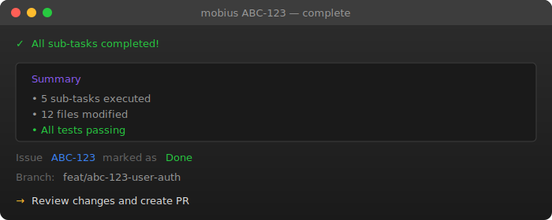

<div align="center">

```
███╗   ███╗ ██████╗ ██████╗ ██╗██╗   ██╗███████╗
████╗ ████║██╔═══██╗██╔══██╗██║██║   ██║██╔════╝
██╔████╔██║██║   ██║██████╔╝██║██║   ██║███████╗
██║╚██╔╝██║██║   ██║██╔══██╗██║██║   ██║╚════██║
██║ ╚═╝ ██║╚██████╔╝██████╔╝██║╚██████╔╝███████║
╚═╝     ╚═╝ ╚═════╝ ╚═════╝ ╚═╝ ╚═════╝ ╚══════╝
```

**Autonomous AI development that works with your existing workflow.**

**Define issues in Linear or Jira. Let your configured runtime implement them. Review and ship.**

[](LICENSE)
[](https://www.rust-lang.org/)

<br>

```bash
curl -fsSL https://raw.githubusercontent.com/Tubular-Health/mobius/main/install.sh | bash
```

**Works on Mac and Linux (x86_64 and aarch64).**

</div>

<p align="center">
  
</p>

---

## Table of Contents

- [Why Mobius?](#why-mobius)
- [Quick Start](#quick-start)
- [Workflow](#workflow)
- [The 4 Skills](#the-4-skills)
- [Parallel Execution](#parallel-execution)
- [Configuration](#configuration)
- [Jira Setup](#jira-setup)
- [Requirements](#requirements)
- [CLI Reference](#cli-reference)
- [Troubleshooting](#troubleshooting)

---

## Why Mobius?

Instead of feeding entire codebases into a single context window, Mobius breaks work into **focused sub-tasks** that each operate with minimal context.

| Benefit | How |
|---------|-----|
| **Lower API Costs** | Each sub-task uses only the context it needs—5-10x fewer tokens than monolithic prompts |
| **Higher Accuracy** | Single-file scope keeps each agent focused, reducing unintended side effects |
| **Parallel Execution** | Sub-tasks without dependencies run simultaneously (up to 10 agents) |
| **Team Visibility** | State lives in Linear/Jira, not hidden files—stop and resume anytime |
| **Safe Autonomy** | Docker sandbox, scoped permissions, verification gates, easy rollback |

---

## Quick Start

```bash
./install.sh        # Download pre-compiled binary
mobius setup         # Interactive setup wizard
mobius ABC-123       # Start working on an issue
```

`mobius setup` prompts for runtime (`claude` or `opencode`) and issue tracker backend.

<p align="center">
  
</p>

---

## Workflow

The complete workflow transforms an idea into a merged PR through 5 steps:

Use your configured runtime CLI (`claude` or `opencode`) for skill commands.

### 1. `/define` — Create the Issue

Use Socratic questioning to create a well-defined issue with clear acceptance criteria.

```bash
claude "/define"      # Claude runtime
opencode "/define"    # OpenCode runtime
```

### 2. `/refine` — Break into Sub-tasks

Analyze your codebase and decompose the issue into focused sub-tasks, each targeting a single file with explicit blocking dependencies.

```bash
claude "/refine ABC-123"      # Claude runtime
opencode "/refine ABC-123"    # OpenCode runtime
```

### 3. `mobius loop` — Execute with Parallel Agents

Run the autonomous execution loop. Unblocked sub-tasks execute simultaneously in isolated git worktrees.

```bash
mobius loop ABC-123              # Parallel execution (default)
mobius loop ABC-123 --parallel=5 # Up to 5 concurrent agents
mobius ABC-123 --sequential      # Sequential fallback
```

### 4. `/verify` — Validate Against Criteria

Review the implementation against acceptance criteria, run final validation, and add review notes.

```bash
claude "/verify ABC-123"      # Claude runtime
opencode "/verify ABC-123"    # OpenCode runtime
```

### 5. `mobius submit` — Create the PR

Create a pull request with proper formatting and linked issues.

```bash
mobius submit ABC-123
```

<p align="center">
  
</p>

---

## The 4 Skills

| Skill | Purpose | Command |
|-------|---------|---------|
| `/define` | Create well-defined issues with acceptance criteria | `claude "/define"` or `opencode "/define"` |
| `/refine` | Break issues into single-file focused sub-tasks | `claude "/refine ABC-123"` or `opencode "/refine ABC-123"` |
| `/execute` | Implement one sub-task (or use `mobius loop` for all) | `claude "/execute ABC-123"` or `opencode "/execute ABC-123"` |
| `/verify` | Validate implementation against acceptance criteria | `claude "/verify ABC-123"` or `opencode "/verify ABC-123"` |

Skills auto-detect your configured backend (Linear or Jira). For explicit selection, use prefixed aliases: `/linear:define`, `/jira:refine`, etc.

---

## Parallel Execution

When sub-tasks have no blocking dependencies, multiple runtime agents work simultaneously in isolated git worktrees.

```bash
mobius loop MOB-123               # Parallel execution (default)
mobius loop MOB-123 --parallel=5  # Override max parallel agents
mobius MOB-123 --sequential       # Sequential execution (bash loop)
```

| Option | Default | Description |
|--------|---------|-------------|
| `max_parallel_agents` | `3` | Maximum concurrent runtime agents (1-10) |
| `worktree_path` | `../<repo>-worktrees/` | Base directory for worktrees |
| `cleanup_on_success` | `true` | Auto-remove worktree on success |
| `base_branch` | `main` | Branch for feature branches |

**Requires tmux** for parallel execution (`brew install tmux` or `apt install tmux`). Use `--sequential` without it.

<p align="center">
  
</p>

---

## Configuration

<details>
<summary>View configuration options</summary>

Edit `~/.config/mobius/config.yaml`:

```yaml
backend: linear  # or jira

execution:
  delay_seconds: 3
  max_iterations: 50
  model: opus
  sandbox: true
  max_parallel_agents: 3
  worktree_path: "../<repo>-worktrees/"
  cleanup_on_success: true
  base_branch: "main"
```

Override with environment variables:

```bash
export MOBIUS_BACKEND=linear
export MOBIUS_MAX_PARALLEL_AGENTS=5
export MOBIUS_SANDBOX_ENABLED=false
```

Commands:

```bash
mobius config          # Show current configuration
mobius config --edit   # Open config in editor
```

</details>

---

## Jira Setup

<details>
<summary>Configure Mobius for Jira</summary>

### 1. Update Configuration

```yaml
backend: jira

jira:
  base_url: https://your-org.atlassian.net
  project_key: PROJ
  auth_method: api_token
```

### 2. Set Environment Variables

```bash
export JIRA_API_TOKEN="your-api-token"  # From Atlassian Account Settings
export JIRA_EMAIL="you@company.com"
```

### 3. Configure Runtime MCP Plugin

Claude example (for OpenCode, configure the equivalent Jira MCP integration in your runtime tool):

Add to your MCP configuration:

```json
{
  "mcpServers": {
    "jira": {
      "command": "npx",
      "args": ["-y", "@anthropic/mcp-server-jira"],
      "env": {
        "JIRA_BASE_URL": "https://your-org.atlassian.net",
        "JIRA_EMAIL": "your-email@company.com",
        "JIRA_API_TOKEN": "${JIRA_API_TOKEN}"
      }
    }
  }
}
```

### 4. Verify

```bash
mobius doctor
```

</details>

---

## Requirements

| Requirement | Notes |
|-------------|-------|
| **Runtime CLI** | Install [Claude Code CLI](https://claude.ai/code) or OpenCode CLI |
| **Git** | Required for worktree operations |
| **Linear or Jira account** | Both backends fully supported |
| **tmux** (optional) | Required for parallel execution |
| **Docker** (optional) | For sandbox mode |

### Environment Variables

| Variable | Backend | Description |
|----------|---------|-------------|
| `LINEAR_API_KEY` | Linear | API key from [Linear Settings](https://linear.app/settings/api) |
| `JIRA_API_TOKEN` | Jira | API token from [Atlassian Settings](https://id.atlassian.com/manage-profile/security/api-tokens) |
| `JIRA_EMAIL` | Jira | Your Atlassian account email |

---

## CLI Reference

```bash
# Parallel execution (default)
mobius loop ABC-123              # Run parallel loop until complete
mobius loop ABC-123 --parallel=5 # Override max parallel agents
mobius ABC-123                   # Alias for parallel loop

# Sequential execution
mobius ABC-123 --sequential      # Use bash sequential loop
mobius ABC-123 --local           # Bypass sandbox
mobius ABC-123 --model=sonnet    # Use specific model

# Management
mobius setup                     # Interactive setup wizard
mobius config                    # Show configuration
mobius doctor                    # Check system requirements
```

---

## Troubleshooting

<details>
<summary>Common issues and solutions</summary>

### "Runtime CLI not found"

- If `runtime: claude`, install Claude Code CLI from [claude.ai/code](https://claude.ai/code)
- If `runtime: opencode`, install OpenCode CLI and confirm `opencode --version` works in your shell

### Wrong runtime selected

Run setup again to switch runtime, then re-run doctor:

```bash
mobius setup
mobius doctor
```

### "Git not configured"

Ensure you're in a git repository with a remote:
```bash
git remote -v
```

### tmux not found

Install tmux or use sequential mode:
```bash
brew install tmux        # macOS
apt install tmux         # Linux
mobius ABC-123 --sequential  # Without tmux
```

### Worktree already exists

```bash
git worktree list
git worktree remove ../mobius-worktrees/ABC-123
```

### Jira authentication failed

- Verify `JIRA_API_TOKEN` and `JIRA_EMAIL` are set correctly
- Ensure your account has access to the project
- Generate a new token from [Atlassian Settings](https://id.atlassian.com/manage-profile/security/api-tokens)

### Docker sandbox fails

```bash
docker info              # Verify Docker is running
mobius ABC-123 --local   # Bypass sandbox
```

</details>

---

<p align="center">
  <strong>MIT License</strong>
</p>

<p align="center">
  <code>./install.sh && mobius setup</code>
</p>
