<p align="center">
  
</p>

# Mobius

AI-powered autonomous development workflow tool. Mobius orchestrates Claude-powered development cycles with pluggable issue tracker backends.

## What is Mobius?

Mobius automates the **Define → Refine → Execute → Verify** workflow for software development:

```mermaid
graph LR
    A[📝 Define] --> B[🔍 Refine]
    B --> C[⚡ Execute]
    C --> D[✅ Verify]
    D -.->|New issues| A

    style A fill:#e1f5fe
    style B fill:#fff3e0
    style C fill:#e8f5e9
    style D fill:#f3e5f5
```



| Step | Description |
|------|-------------|
| **Define** | Create well-defined issues with clear acceptance criteria |
| **Refine** | Break down issues into small, focused sub-tasks |
| **Execute** | Autonomously implement sub-tasks one at a time |
| **Verify** | Validate implementation against acceptance criteria |

### Execution Loop

Mobius runs Claude in a continuous loop, executing sub-tasks until an issue is complete:


## Installation

### npm (Recommended)

```bash
# Install globally
npm install -g mobius

# Run interactive setup
mobius setup

# Verify installation
mobius doctor
```

The setup wizard will configure:
- Installation type (global or per-project)
- Issue tracker backend (Linear, Jira)
- Claude model and execution settings
- Skills and commands

### Manual Installation

```bash
# Clone the repository
git clone https://github.com/your-username/mobius.git
cd mobius

# Run the installer
./install.sh
```

The installer will:
- Install the `mobius` command to `~/.local/bin/`
- Create configuration at `~/.config/mobius/config.yaml`
- Install Claude skills to `~/.claude/skills/`

Make sure `~/.local/bin` is in your PATH:
```bash
export PATH="$HOME/.local/bin:$PATH"
```

### Requirements

- **Node.js 18+** - For npm installation
- **Claude Code CLI** - Install from [claude.ai/code](https://claude.ai/code)
- **Linear MCP tools** - Auto-configured via Claude Code (for Linear backend)
- **Docker** (optional) - For sandbox mode

## Usage

```bash
# Execute sub-tasks of an issue
mobius VER-159

# Limit iterations
mobius VER-159 10

# Run locally (bypass sandbox)
mobius VER-159 --local

# Use a different model
mobius VER-159 --model=sonnet

# Show current configuration
mobius config

# Edit configuration
mobius config --edit

# Check system requirements
mobius doctor

# Re-run setup wizard
mobius setup

# Get help
mobius --help
```

## The 4-Step Workflow

### 1. Define (`/linear:define`)

Create a well-defined issue through Socratic questioning:

```bash
claude "/linear:define"
```

Claude will ask questions to clarify requirements and create an issue with:
- Clear title and description
- Acceptance criteria
- Appropriate labels and priority

### 2. Refine (`/linear:refine`)

Break down the issue into implementable sub-tasks:

```bash
claude "/linear:refine VER-159"
```

This analyzes your codebase and creates sub-tasks that are:
- Small enough for a single focus area
- Ordered with blocking dependencies
- Detailed with specific files and changes

### 3. Execute (`mobius`)

Run the autonomous loop to implement sub-tasks:

```bash
mobius VER-159
```

Each iteration:
1. Finds the next ready sub-task (not blocked)
2. Implements the change
3. Runs validation commands from `AGENTS.md`
4. Commits with a descriptive message
5. Marks the sub-task complete
6. Continues until all sub-tasks are done

### 4. Verify (`/linear:verify`)

Review the implementation against acceptance criteria:

```bash
claude "/linear:verify VER-159"
```

Claude will:
- Compare implementation to acceptance criteria
- Run final validation
- Add review notes as a comment on the issue
- Mark the issue complete if everything passes

## Configuration

### Config File

Edit `~/.config/mobius/config.yaml`:

```yaml
# Issue tracker backend: linear | jira
backend: linear

# Execution settings
execution:
  delay_seconds: 3
  max_iterations: 50
  model: opus
  sandbox: true
  container_name: mobius-sandbox
```

### Environment Variables

Override config settings with environment variables:

```bash
export MOBIUS_BACKEND=linear
export MOBIUS_DELAY_SECONDS=5
export MOBIUS_MAX_ITERATIONS=100
export MOBIUS_MODEL=sonnet
export MOBIUS_SANDBOX_ENABLED=false
```

### Project Setup: AGENTS.md

Copy the `AGENTS.md` template to your project root and customize it:

```bash
cp /path/to/mobius/AGENTS.md ./AGENTS.md
```

This file provides project-specific context to Claude each iteration:
- Build and validation commands
- Codebase patterns and conventions
- Common issues and solutions
- Project structure

## Supported Backends


### Linear (Default)

Uses Linear MCP tools via Claude Code. No additional configuration required.

**Skills provided:**
- `/linear:define` - Create issues
- `/linear:refine` - Break down into sub-tasks
- `/linear:execute` - Execute next sub-task
- `/linear:verify` - Verify implementation

### Jira (Planned)

Future support for Jira integration.

```yaml
backend: jira
jira:
  base_url: https://yourcompany.atlassian.net
  project_key: PROJ
```

## Sandbox Mode

By default, Mobius runs Claude in a Docker sandbox for safer autonomous execution. This isolates file system changes and prevents accidental damage.

To bypass sandbox mode:
```bash
mobius VER-159 --local
```

Or disable in config:
```yaml
execution:
  sandbox: false
```

## Example Workflow

```mermaid
sequenceDiagram
    participant Dev as Developer
    participant Claude as Claude CLI
    participant Mobius as Mobius
    participant Linear as Linear

    Dev->>Claude: /linear:define
    Claude->>Linear: Create VER-160
    Linear-->>Dev: Issue created

    Dev->>Claude: /linear:refine VER-160
    Claude->>Linear: Create 5 sub-tasks
    Linear-->>Dev: Sub-tasks with dependencies

    Dev->>Mobius: mobius VER-160
    loop For each sub-task
        Mobius->>Linear: Get next ready task
        Mobius->>Mobius: Implement & validate
        Mobius->>Linear: Mark complete
    end
    Mobius-->>Dev: All tasks done

    Dev->>Claude: /linear:verify VER-160
    Claude->>Linear: Add review comment
    Linear-->>Dev: Issue verified ✓
```



```bash
# 1. Define a new feature
claude "/linear:define"
# → Creates VER-160: "Add user authentication"

# 2. Break it down into sub-tasks
claude "/linear:refine VER-160"
# → Creates 5 sub-tasks with dependencies

# 3. Execute the implementation
mobius VER-160
# → Implements each sub-task autonomously

# 4. Verify the implementation
claude "/linear:verify VER-160"
# → Reviews and marks complete
```

## Troubleshooting

### "Claude CLI not found"

Install Claude Code CLI from [claude.ai/code](https://claude.ai/code).

### "cclean not found"

The `cclean` utility formats Claude's JSON output. Mobius will still work without it, but output will be less readable.

### Mobius stops unexpectedly

Check the iteration limit in your config:
```bash
mobius --config
```

Increase `max_iterations` if needed, or set to `0` for unlimited.

### Sub-tasks not executing in order

Ensure sub-tasks have proper `blockedBy` relationships set during refinement. The loop respects these dependencies.

## License

MIT
